# Architecture Diagrams - Todou POS App

Ce fichier contient tous les diagrammes de l'architecture en format **Mermaid**.

> 💡 **Visualisation** : Ces diagrammes s'affichent automatiquement sur GitHub, GitLab, ou avec l'extension VS Code "Markdown Preview Mermaid Support"

---

## 1. Vue d'ensemble - Clean Architecture par Couches

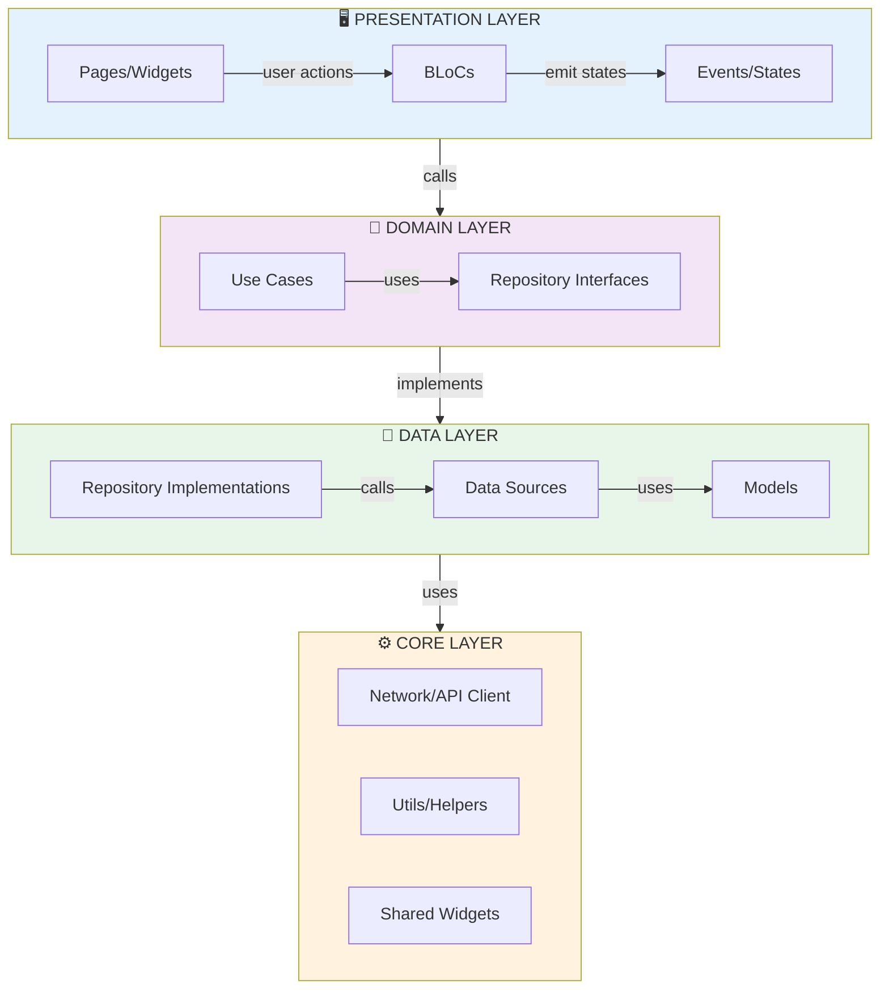

---

## 2. Architecture par Features

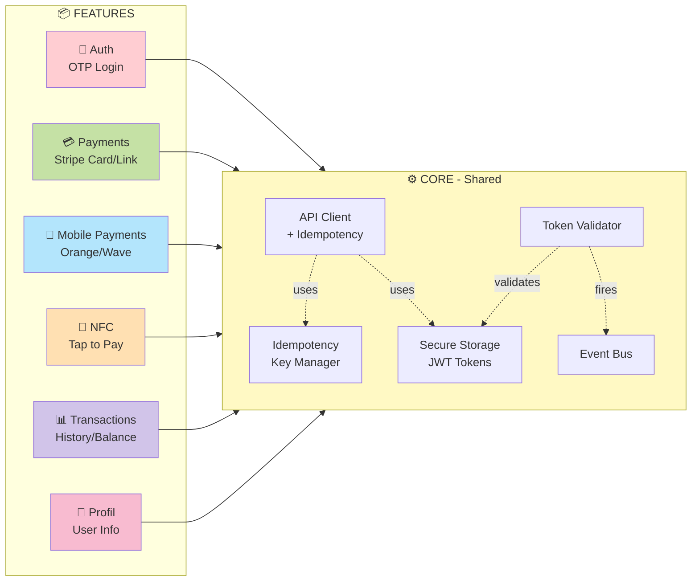

---

## 3. Flux Complet - Paiement Stripe avec Idempotence

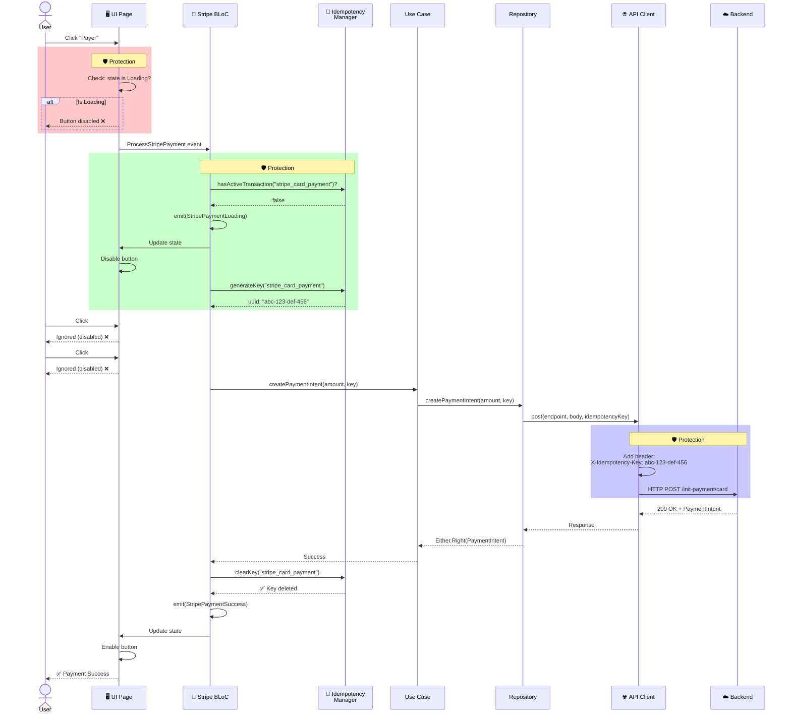

---

## 4. Gestion des Clés d'Idempotence

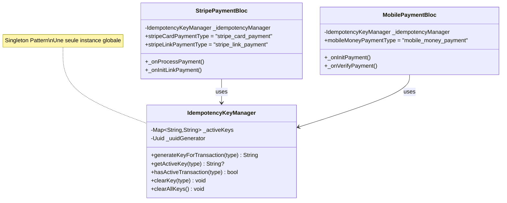

---

## 5. États BLoC - Stripe Payment

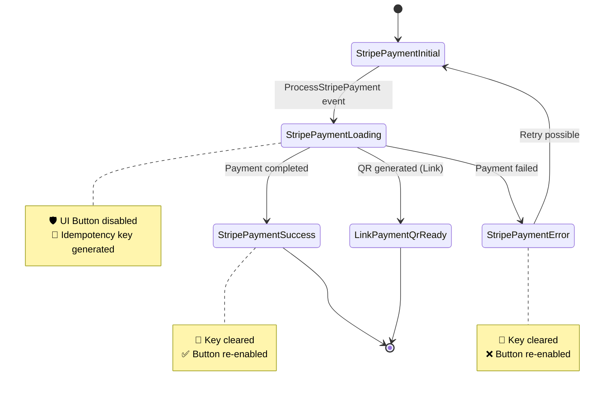

---

## 6. États BLoC - Mobile Payment

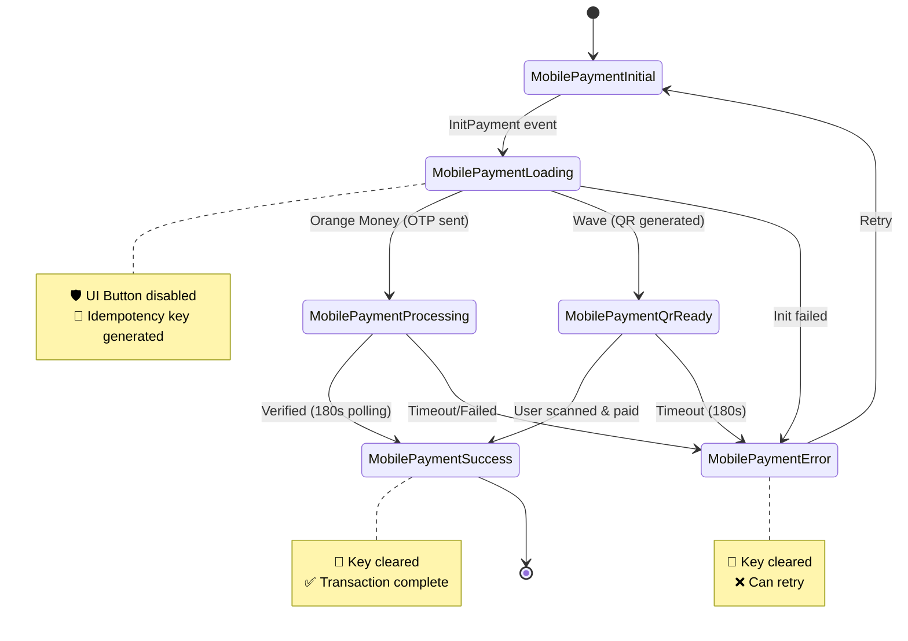

---

## 7. Architecture Réseau - API Client

```mermaid
graph TB
    subgraph BLoCs["BLoCs Layer"]
        StripeBLoC[Stripe Payment BLoC]
        MobileBLoC[Mobile Payment BLoC]
    end

    subgraph Repositories["Repository Layer"]
        StripeRepo[Stripe Repository]
        MobileRepo[Mobile Repository]
    end

    subgraph Network["Network Layer"]
        ApiClient[API Client]
        IdempMgr2[Idempotency Manager]
    end

    subgraph Backend2["Backend API"]
        AuthEndpoint[/merchants/terminals/verify-otp]
        StripeEndpoint[/transactions/init-payment/card]
        MobileEndpoint[/transactions/init-payment/mobile-money]
    end

    StripeBLoC -->|idempotencyKey| StripeRepo
    MobileBLoC -->|idempotencyKey| MobileRepo

    StripeRepo -->|post with key| ApiClient
    MobileRepo -->|post with key| ApiClient

    ApiClient -->|reads/writes| IdempMgr2
    ApiClient -->|X-Idempotency-Key header| StripeEndpoint
    ApiClient -->|X-Idempotency-Key header| MobileEndpoint
    ApiClient -->|no key needed| AuthEndpoint

    style IdempMgr2 fill:#fff59d
    style ApiClient fill:#90caf9
```

---

## 8. Flux de Sécurité - Token Management

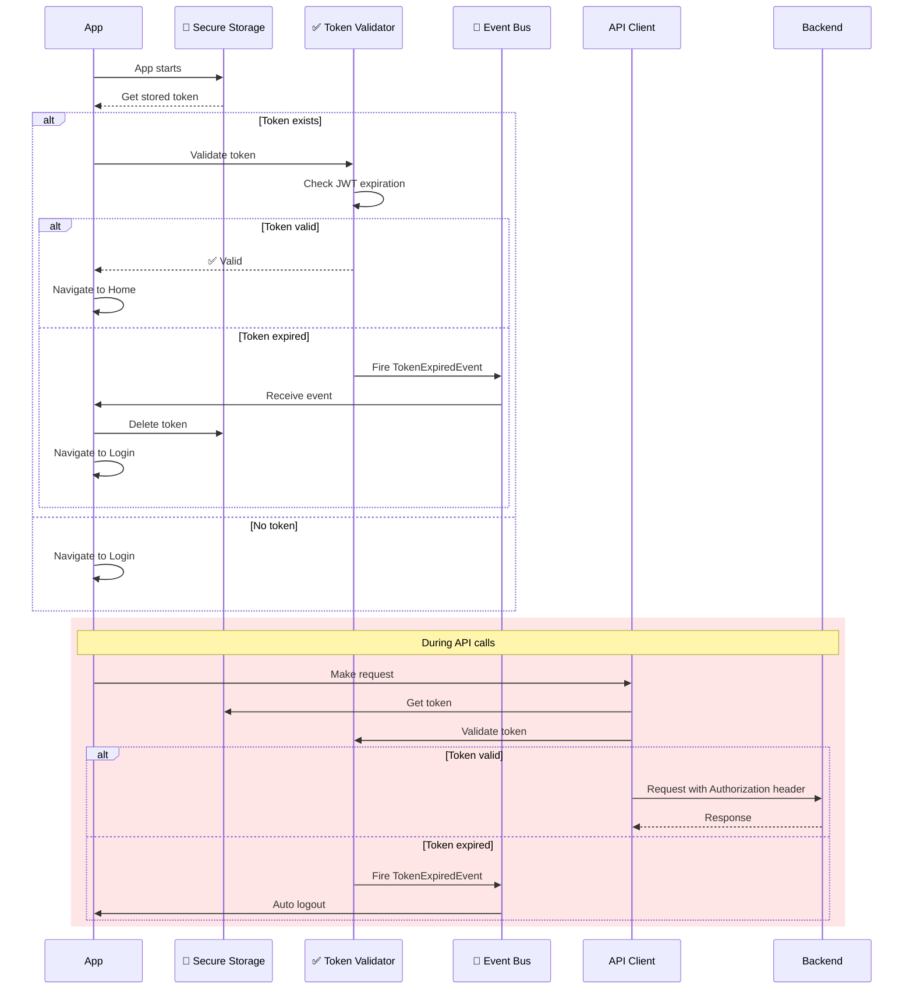

---

## 9. Feature Auth - Architecture Détaillée

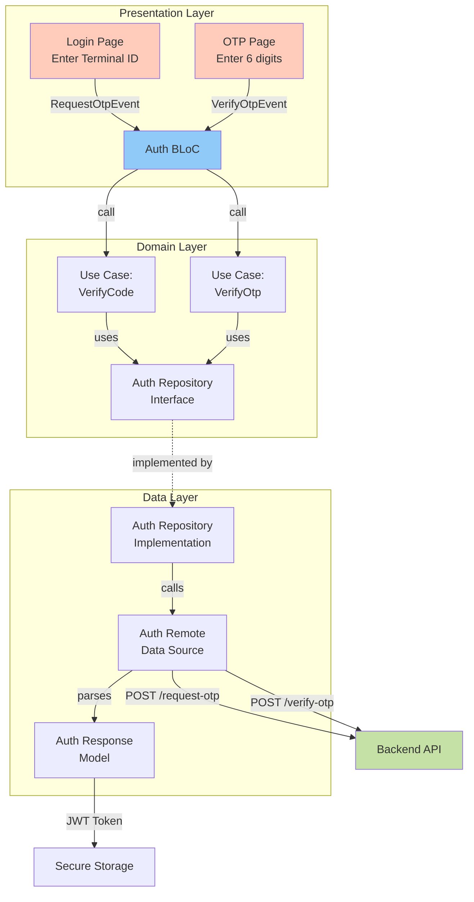

---

## 10. Feature Payments - Architecture Détaillée

```mermaid
graph TB
    subgraph Presentation2["Presentation Layer"]
        StripePayPage[Stripe Payment Page]
        CardPage[Card Page]
        LinkPage[Link Payment Page]
        StripeBLoC2[Stripe Payment BLoC<br/>+ Idempotency Protection]
    end

    subgraph Domain2["Domain Layer"]
        InitLinkPayment[Use Case:<br/>InitLinkPayment]
        StripeRepoInterface[Stripe Repository<br/>Interface]
    end

    subgraph Data2["Data Layer"]
        StripeRepoImpl2[Stripe Repository Impl<br/>+ idempotencyKey param]
        StripeModel[Payment Intent<br/>Response Model]
    end

    subgraph Core3["Core Layer"]
        IdempMgr3[🔑 Idempotency Manager]
        ApiClient2[API Client<br/>+ X-Idempotency-Key header]
    end

    StripePayPage -->|ProcessStripePayment| StripeBLoC2
    CardPage -->|ProcessStripePayment| StripeBLoC2
    LinkPage -->|InitLinkPayment| StripeBLoC2

    StripeBLoC2 -->|generate key| IdempMgr3
    StripeBLoC2 -->|check active| IdempMgr3
    StripeBLoC2 -->|call with key| InitLinkPayment

    InitLinkPayment -->|uses| StripeRepoInterface
    StripeRepoInterface -.implemented by.-> StripeRepoImpl2

    StripeRepoImpl2 -->|post with key| ApiClient2
    ApiClient2 -->|POST + header| Backend2[Backend API]
    Backend2 -->|response| StripeModel

    StripeBLoC2 -->|on success/error| IdempMgr3
    Note right of IdempMgr3: clearKey() after<br/>success or final error

    style StripeBLoC2 fill:#fff59d
    style IdempMgr3 fill:#ffccbc
    style ApiClient2 fill:#90caf9
```

---

## 11. Triple Protection contre les Doublons

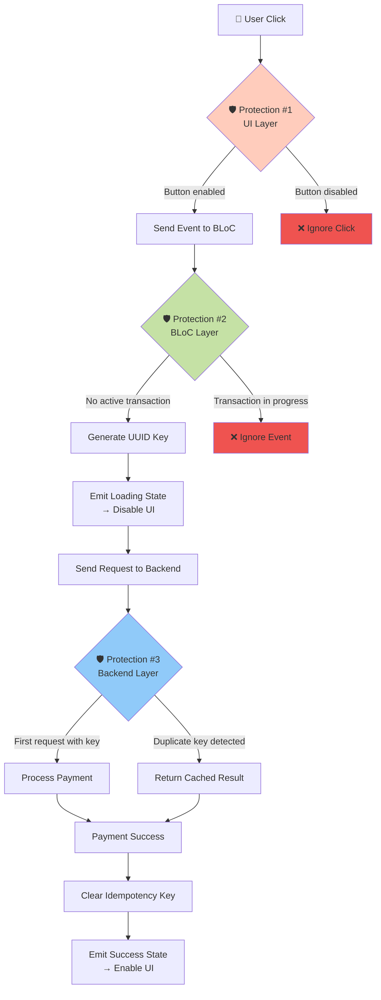

---

## 12. Types de Transactions & Clés

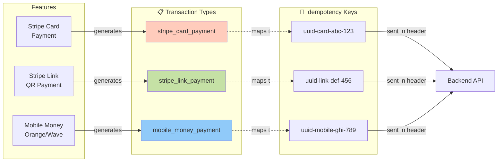

---

## 13. Lifecycle d'une Clé d'Idempotence

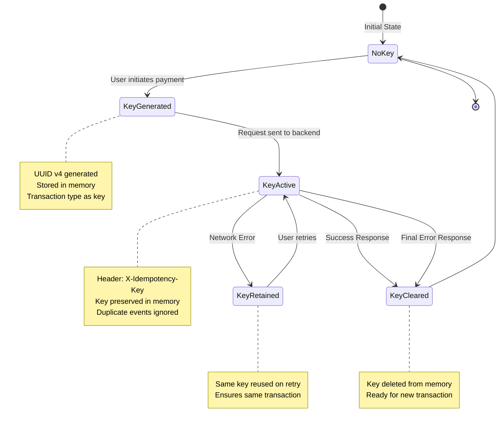

---

## 14. Diagramme de Déploiement

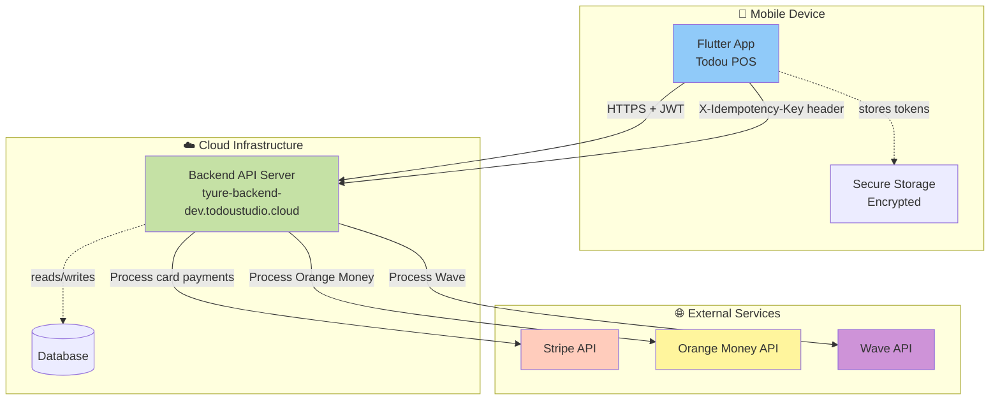

---

## 15. Patterns & Principes Appliqués

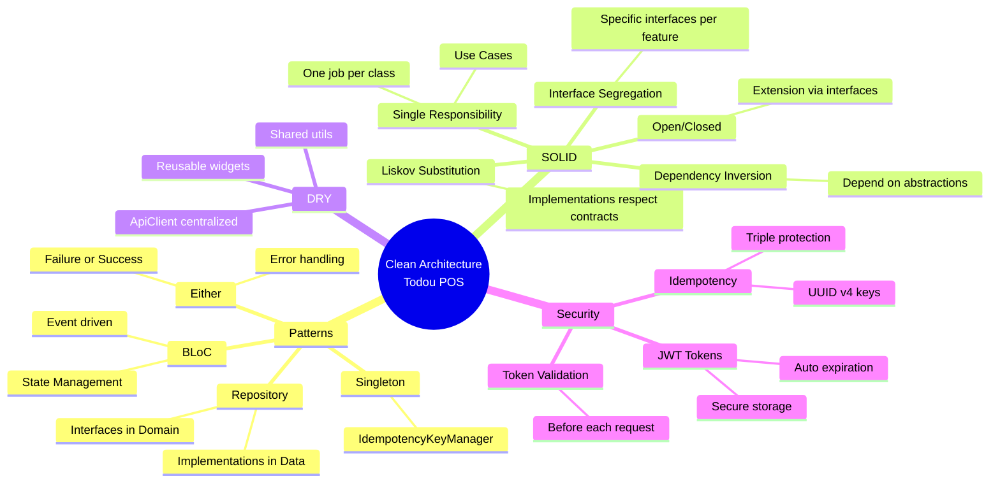

---

## Instructions d'utilisation

### Visualiser les diagrammes

1. **Sur GitHub/GitLab** : Les diagrammes s'affichent automatiquement
2. **VS Code** : Installer l'extension "Markdown Preview Mermaid Support"
3. **En ligne** : https://mermaid.live (copier/coller le code)

### Exporter en images

```bash
# Installation de mermaid-cli
npm install -g @mermaid-js/mermaid-cli

# Exporter un diagramme en PNG
mmdc -i ARCHITECTURE_DIAGRAMS.md -o diagram.png
```

### Modifier les diagrammes

La syntaxe Mermaid est simple :
- `graph TB` : Graphe vertical
- `sequenceDiagram` : Diagramme de séquence
- `stateDiagram-v2` : Diagramme d'états
- `classDiagram` : Diagramme de classes
- `mindmap` : Carte mentale

Documentation complète : https://mermaid.js.org/
