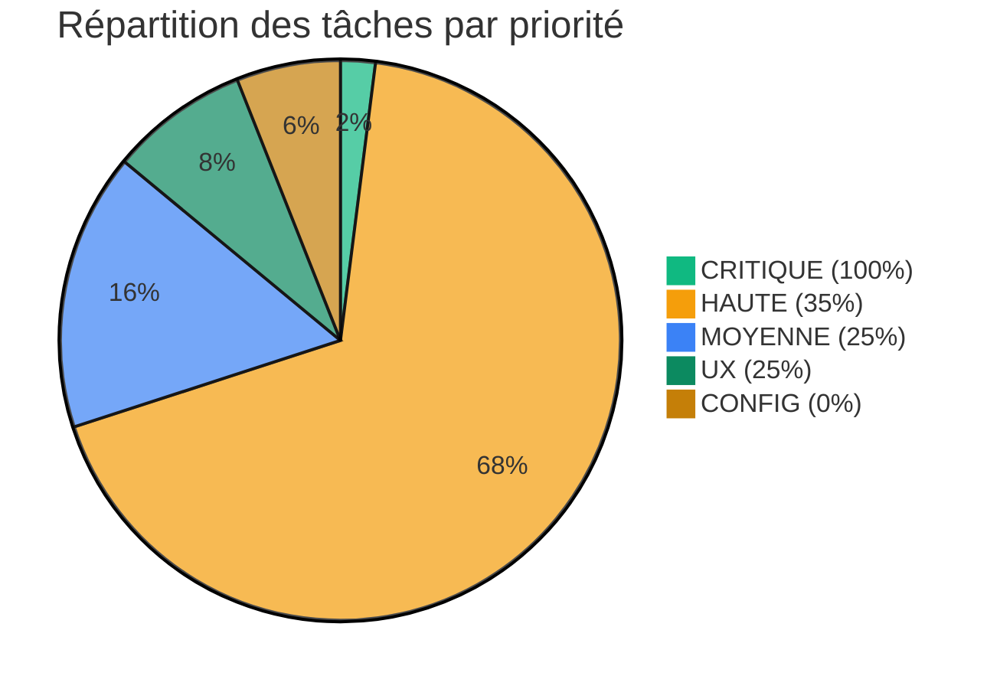
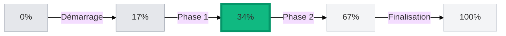
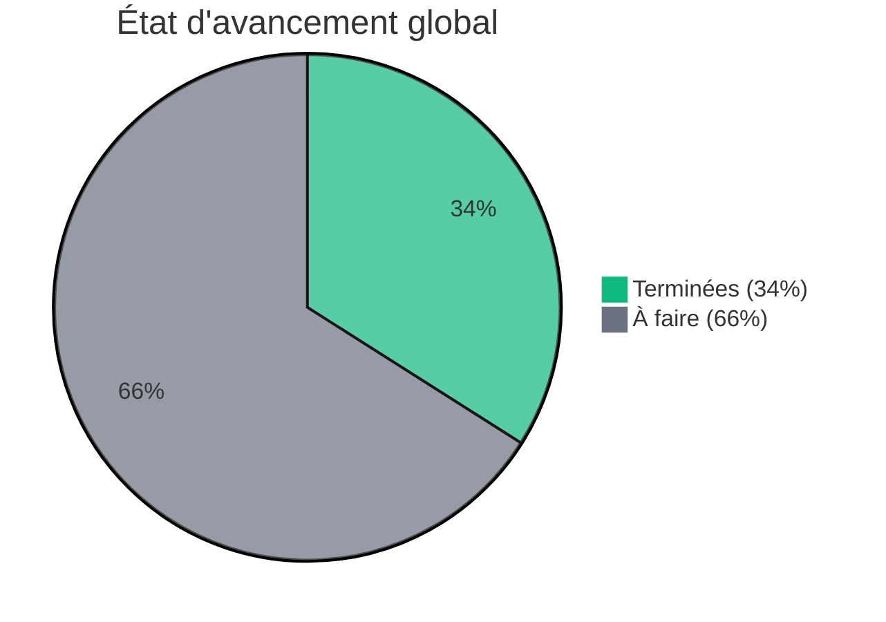
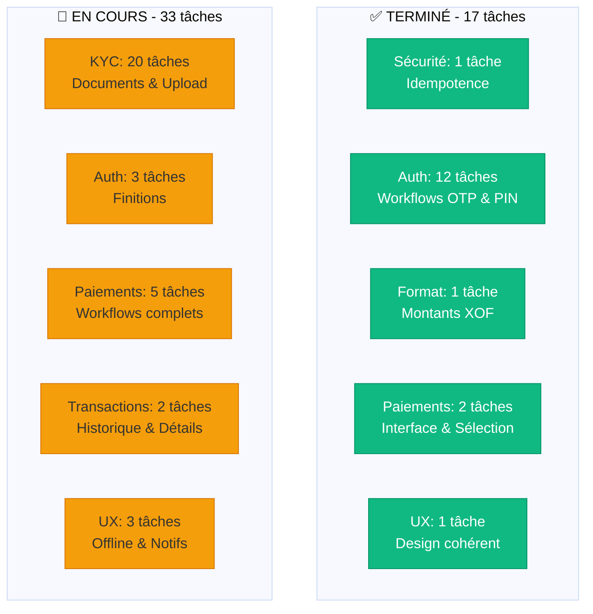

# 📊 RAPPORT DE PROGRESSION - APPLICATION MOBILE POS

> **Date**: 8 Janvier 2025
> **Projet**: YURE Mobile POS - Features Bonheur
> **Type**: Rapport managerial synthétique

---

## 🎯 VUE D'ENSEMBLE

### Indicateurs Clés

| Métrique | Valeur | Statut |
|----------|--------|--------|
| **Tâches totales** | 50 | 📋 |
| **Tâches terminées** | 17 | ✅ |
| **Tâches en cours** | 0 | 🔄 |
| **Tâches à faire** | 33 | ⏸️ |
| **Points de blocage** | 0 | 🟢 |
| **Progression globale** | **34%** | 🟡 |

### Budget Temps

| Catégorie | Consommé | Total | % |
|-----------|----------|-------|---|
| **Heures réalisées** | 18.5h | 53.5h | 34.6% |
| **Heures restantes** | 35h | 53.5h | 65.4% |

---

## 📈 PROGRESSION PAR PRIORITÉ

### Détails par priorité

| Priorité | Complétées | Total | % Achevé | Heures |
|----------|-----------|-------|----------|---------|
| 🔴 **CRITIQUE** | 1 | 1 | **100%** | 3h/3h ✅ |
| 🟠 **HAUTE** | 12 | 34 | **35%** | 12h/34h 🟡 |
| 🟡 **MOYENNE** | 2 | 8 | **25%** | 2.5h/9h 🟡 |
| 🔵 **UX** | 1 | 4 | **25%** | 1h/5h 🟡 |
| ⚙️ **CONFIG** | 1 | 3 | **33%** | 1h/2.5h 🟡 |

---

## 🎯 JAUGE DE PROGRESSION

### Progression visuelle

🟩🟩🟩⬜⬜⬜⬜⬜⬜⬜ **34%** complété

---

## 📊 RÉPARTITION DES TÂCHES

---

## 🏗️ DOMAINES FONCTIONNELS

---

## 📋 TÂCHES COMPLÉTÉES (17)

### 🔐 Sécurité (1 tâche)
- ✅ **APP-017** - Clés d'idempotence (prévention doublons paiements)

### 🔑 Authentification (12 tâches)
- ✅ **APP-001** - Écran connexion email/mot de passe
- ✅ **APP-002** - Envoi OTP
- ✅ **APP-003** - Validation OTP
- ✅ **APP-004** - Gestion OTP invalide
- ✅ **APP-005** - Gestion OTP expiré
- ✅ **APP-006** - Renvoyer OTP
- ✅ **APP-007** - Sélection terminal
- ✅ **APP-008** - Création code PIN
- ✅ **APP-009** - Confirmation PIN
- ✅ **APP-010** - Ignorer création PIN
- ✅ **APP-011** - Écran saisie PIN au démarrage
- ✅ **APP-012** - Validation PIN

### 💰 Format & Affichage (1 tâche)
- ✅ **APP-016** - Affichage montants en XOF

### 💳 Paiements (2 tâches)
- ✅ **APP-PAY-001** - Écran paiement principal
- ✅ **APP-PAY-002** - Sélection mode de paiement

### 🎨 UX & Configuration (1 tâche)
- ✅ **APP-UI-001** - Design cohérent
- ✅ **APP-SETTINGS-001** - Écran paramètres

---

## 🎯 PROCHAINES ÉTAPES (3 priorités)

### Priorité 1: Finaliser l'Authentification
- 3 tâches restantes (PIN invalide, Code oublié, Changement terminal)
- Impact: Sécurisation complète de l'accès

### Priorité 2: KYC Mobile
- 20 tâches à réaliser
- Impact critique: Conformité réglementaire

### Priorité 3: Workflows Paiements
- 5 tâches restantes
- Impact: Expérience utilisateur complète

---

## ✅ POINTS DE BLOCAGE

**Aucun blocage identifié** - Développement fluide

---

## 📅 PLANNING PRÉVISIONNEL

| Phase | Tâches | Durée | Statut |
|-------|--------|-------|--------|
| **Phase 1: Auth & Sécurité** | 15 | 17.5h | ✅ Terminé |
| **Phase 2: KYC** | 20 | 18.5h | ⏸️ À faire |
| **Phase 3: Paiements & Transactions** | 9 | 10h | 🔄 En cours |
| **Phase 4: UX & Config** | 6 | 7.5h | ⏸️ À faire |

---

## 💡 RECOMMANDATIONS

1. **Accélérer le KYC**: 20 tâches critiques pour conformité réglementaire
2. **Excellent rythme**: Authentification quasi terminée (80% complété)
3. **Momentum positif**: 34% du projet réalisé en phase initiale

---

**Rapport généré automatiquement** | YURE POS Mobile
