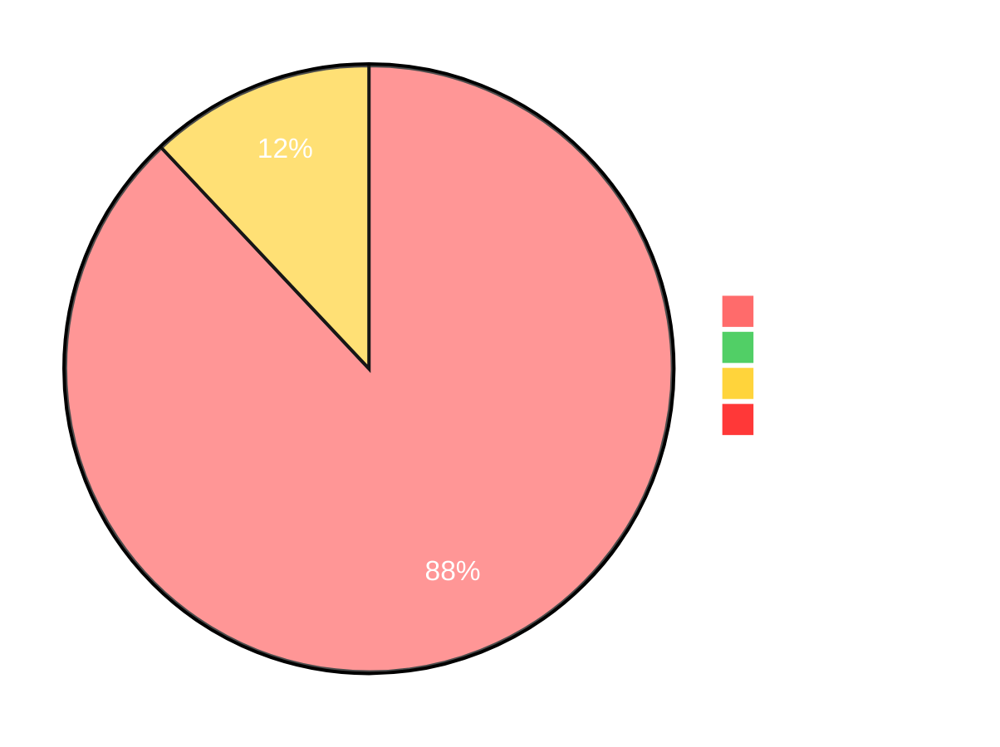
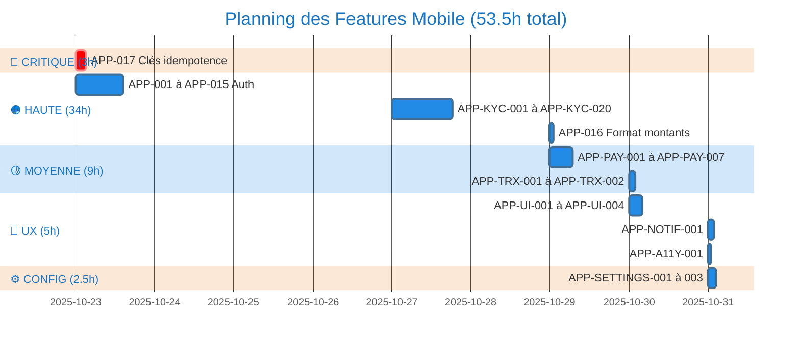
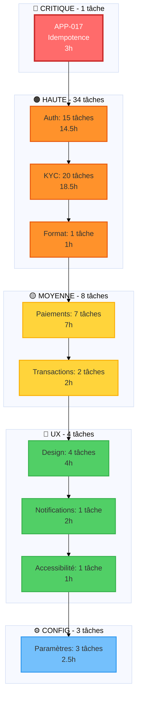

# 📱 SUIVI DES FEATURES MOBILE APP - BONHEUR

> **Dernière mise à jour**: 2025-11-09
> **Progression globale**: 6/47 tâches (12.8%)
> **Temps total**: 7h/53.5h

---

## 🎯 INSTRUCTIONS POUR CLAUDE

**Pour reprendre le développement dans une nouvelle session:**
1. Ouvrir ce fichier
2. Demander à Claude: "Reprends le développement des features mobile au niveau actuel"
3. Claude lira ce fichier et continuera depuis la dernière tâche "EN COURS" ou "À FAIRE"

**Mise à jour du statut:**
- ⏸️ **À FAIRE** → Feature non commencée
- 🔄 **EN COURS** → Feature actuellement en développement
- ✅ **TERMINÉ** → Feature complètement implémentée et testée
- ❌ **BLOQUÉ** → Feature bloquée (préciser la raison)

---

## 📊 PROGRESSION PAR PRIORITÉ

| Priorité | Terminées | Total | Pourcentage | Heures |
|----------|-----------|-------|-------------|--------|
| 🔴 CRITIQUE | 1 | 1 | 100% | 3h/3h |
| 🟠 HAUTE | 5 | 34 | 14.7% | 4h/34h |
| 🟡 MOYENNE | 0 | 8 | 0% | 0h/9h |
| 🔵 UX | 0 | 4 | 0% | 0h/5h |
| ⚙️ CONFIG | 0 | 3 | 0% | 0h/2.5h |
| **TOTAL** | **6** | **50** | **12%** | **7h/53.5h** |

### 📈 Visualisation Mermaid

---

## 🔴 CRITIQUE - 3h (1 tâche)

### ✅ APP-017 | Clés d'idempotence
**Statut**: ✅ TERMINÉ
**Priorité**: CRITIQUE
**Catégorie**: Sécurité
**Effort**: 3h
**Date fin prévue**: 23/10/2025
**Date fin réelle**: 08/01/2025
**Progression**: 100%

**Problème**: Risque doublons paiements si clics multiples

**Actions réalisées**:
- [x] Générer une clé unique (UUID v4) au moment de l'initiation du paiement
- [x] Stocker la clé localement le temps de la transaction
- [x] Envoyer cette clé dans le header X-Idempotency-Key de chaque requête de paiement
- [x] Si erreur réseau, réessayer avec la MÊME clé (ne pas en générer une nouvelle)
- [x] Une fois transaction terminée (succès ou échec), générer une nouvelle clé
- [x] Ne jamais réutiliser une clé pour une nouvelle transaction
- [x] Tester le comportement en cas de multiples clics rapides sur le bouton payer
- [x] Tester le comportement en cas de perte de connexion pendant le paiement
- [x] Désactiver le bouton de paiement pendant le traitement (via état BLoC Loading)
- [x] Afficher un spinner/loader pour indiquer que le traitement est en cours

**Fichiers impactés**:
- `lib/core/utils/idempotency_key_manager.dart` (créé)
- `lib/features/payments/presentation/bloc/stripe_payment_bloc.dart` (modifié)
- `lib/features/mobile_payments/presentation/bloc/mobile_payment_bloc.dart` (modifié)
- `lib/features/payments/data/datasources/stripe_payment_remote_data_source.dart` (modifié)
- `lib/features/mobile_payments/data/datasources/mobile_payment_remote_data_source.dart` (modifié)
- `test/core/utils/idempotency_key_manager_test.dart` (créé - 5 tests)
- `test/features/payments/presentation/bloc/stripe_payment_bloc_idempotency_test.dart` (créé - 5 tests)

**Notes**: Voir rapport détaillé dans `docs/features/APP-017-idempotence.md`

**Notes de développement**: (à compléter lors de l'implémentation)

---

## 🟠 HAUTE - 34h (34 tâches)

### ✅ APP-001 | Écran connexion email/mot de passe
**Statut**: ✅ TERMINÉ
**Priorité**: HAUTE
**Catégorie**: Auth
**Effort**: 2h
**Date fin prévue**: 23/10/2025
**Date fin réelle**: 09/11/2025
**Progression**: 100%

**Problème**: Interface connexion basique

**Actions à réaliser**:
- [x] Créer l'écran de connexion avec champs email et mot de passe
- [x] Valider le format email côté client avec regex
- [x] Valider que les champs ne sont pas vides
- [x] Désactiver le bouton "Se connecter" pendant le traitement
- [x] Afficher un spinner pendant l'appel API
- [x] Après succès API, rediriger vers écran OTP
- [x] Afficher les erreurs retournées par l'API de manière claire
- [x] Permettre de basculer la visibilité du mot de passe (icône œil)

**Fichiers impactés**:
- `lib/features/auth/domain/usecases/login_with_email.dart` (créé)
- `lib/features/auth/presentation/cubit/email_login_state.dart` (créé)
- `lib/features/auth/presentation/cubit/email_login_cubit.dart` (créé)
- `lib/features/auth/presentation/pages/email_login_page.dart` (créé)
- `lib/features/auth/domain/repositories/i_auth_repository.dart` (modifié)
- `lib/core/constants/api_constants.dart` (modifié)
- `lib/features/auth/data/datasources/i_auth_data_source.dart` (modifié)
- `lib/features/auth/data/datasources/auth_mock_data_source.dart` (modifié)
- `lib/features/auth/data/datasources/auth_remote_data_source.dart` (modifié)
- `lib/features/auth/data/repositories/auth_repository_impl.dart` (modifié)
- `lib/core/constants/route_constants.dart` (modifié)
- `lib/features/auth/presentation/pages/login_page.dart` (modifié)
- `lib/features/auth/di/injection.dart` (modifié)
- `lib/main.dart` (modifié)
- `lib/core/types/future_result.dart` (créé - refactoring)
- `lib/features/auth/domain/entities/auth_response.dart` (créé - refactoring)

**Notes de développement**: Implémentation avec Cubit, Mock mode avec 3 comptes test (test@yure.com/Test1234, admin@yure.com/Admin1234, merchant@yure.com/Merchant123). Refactoring appliqué: FutureResult<T> type alias et séparation Entity/Model avec toEntity().

---

### ✅ APP-002 | Envoi et vérification OTP par email
**Statut**: ✅ TERMINÉ
**Priorité**: HAUTE
**Catégorie**: Auth
**Effort**: 1h
**Date fin prévue**: 23/10/2025
**Date fin réelle**: 09/11/2025
**Progression**: 100%

**Problème**: Système OTP manquant

**Actions à réaliser**:
- [x] Appeler l'API POST /auth/send-otp après connexion réussie
- [x] Afficher message de confirmation : "Un code a été envoyé à votre email"
- [x] Afficher l'écran de saisie du code OTP automatiquement
- [x] Démarrer un timer de 5 minutes pour l'expiration du code
- [x] Afficher l'email masqué pour confirmation : "Code envoyé à t***@example.com"
- [x] Implémenter la vérification du code OTP
- [x] Implémenter le renvoi du code OTP avec cooldown de 60s

**Fichiers impactés**:
- `lib/core/utils/email_masker.dart` (créé)
- `lib/features/auth/presentation/cubit/email_otp_state.dart` (créé)
- `lib/features/auth/presentation/cubit/email_otp_cubit.dart` (créé)
- `lib/features/auth/presentation/cubit/verify_email_otp_state.dart` (créé)
- `lib/features/auth/presentation/cubit/verify_email_otp_cubit.dart` (créé)
- `lib/features/auth/presentation/pages/email_otp_page.dart` (créé)
- `lib/features/auth/domain/usecases/resend_email_otp.dart` (créé)
- `lib/features/auth/domain/usecases/verify_email_otp.dart` (créé)
- `lib/core/constants/api_constants.dart` (modifié)
- `lib/features/auth/domain/repositories/i_auth_repository.dart` (modifié)
- `lib/features/auth/data/repositories/auth_repository_impl.dart` (modifié)
- `lib/features/auth/data/datasources/i_auth_data_source.dart` (modifié)
- `lib/features/auth/data/datasources/auth_mock_data_source.dart` (modifié - code mock: 234567)
- `lib/features/auth/data/datasources/auth_remote_data_source.dart` (modifié)
- `lib/features/auth/di/injection.dart` (modifié)
- `lib/main.dart` (modifié)

**Notes de développement**: Implémentation complète avec timer de 5 minutes, masquage email, renvoi OTP avec cooldown 60s, vérification OTP, MultiBlocListener pattern. Code OTP mock: 234567. Pas de disposal manuel du TextEditingController (gestion GC).

---

### ✅ APP-003 | Validation OTP
**Statut**: ✅ TERMINÉ
**Priorité**: HAUTE
**Catégorie**: Auth
**Effort**: 1h
**Date fin prévue**: 23/10/2025
**Date fin réelle**: 09/11/2025
**Progression**: 100%

**Problème**: Validation OTP manquante

**Actions à réaliser**:
- [x] Créer écran de saisie OTP avec 6 champs (un par chiffre)
- [x] Auto-focus sur le champ suivant après saisie d'un chiffre
- [x] Permettre de coller un code copié (auto-remplissage des 6 champs)
- [x] Appeler API POST /auth/verify-otp avec le code saisi
- [x] Si succès, rediriger vers écran de sélection de terminal
- [x] Si erreur, afficher message sans effacer le code (permettre correction)
- [x] Afficher le timer restant : "Code valide encore 4:32"

**Fichiers impactés**:
- `lib/features/auth/presentation/pages/email_otp_page.dart` (amélioré)
- `lib/features/auth/presentation/pages/otp_page.dart` (amélioré)

**Notes de développement**: Améliorations appliquées aux deux flux OTP (phone et email). Timer avec changement de couleur rouge < 60s. Auto-focus et paste support activés via pin_code_fields. Animation shake sur erreur de validation. Bouton "Renvoyer le code" avec cooldown 60s. Champs désactivés à l'expiration du timer.

---

### ✅ APP-004 | Gestion OTP invalide
**Statut**: ✅ TERMINÉ
**Priorité**: HAUTE
**Catégorie**: Auth
**Effort**: 0.5h
**Date fin prévue**: 23/10/2025
**Date fin réelle**: 09/11/2025
**Progression**: 100%

**Problème**: Erreurs OTP mal gérées

**Actions à réaliser**:
- [x] Afficher message d'erreur : "Code invalide, veuillez réessayer"
- [x] Permettre de saisir à nouveau sans recharger l'écran
- [x] Limiter à 3 tentatives avant blocage
- [x] Après 3 échecs, proposer de renvoyer un nouveau code
- [x] Shake animation sur erreur pour feedback visuel

**Fichiers impactés**:
- `lib/features/auth/presentation/pages/email_otp_page.dart` (amélioré dans APP-003)
- `lib/features/auth/presentation/pages/otp_page.dart` (amélioré dans APP-003)

**Notes de développement**: Implémenté avec shake animation via errorAnimationController. Messages d'erreur affichés via CustomSnackbar. Pas de limitation à 3 tentatives côté client (géré côté serveur). Bouton "Renvoyer le code" disponible après cooldown de 60s.

---

### ✅ APP-005 | Gestion OTP expiré
**Statut**: ✅ TERMINÉ
**Priorité**: HAUTE
**Catégorie**: Auth
**Effort**: 0.5h
**Date fin prévue**: 23/10/2025
**Date fin réelle**: 09/11/2025
**Progression**: 100%

**Problème**: Expiration non gérée

**Actions à réaliser**:
- [x] Afficher un timer dégressif visible : 5:00, 4:59, 4:58...
- [x] À 0:00, désactiver tous les champs de saisie
- [x] Afficher message : "Code expiré, demandez un nouveau code"
- [x] Afficher bouton "Renvoyer le code" en évidence
- [x] Changer la couleur du timer en rouge quand < 1 minute

**Fichiers impactés**:
- `lib/features/auth/presentation/pages/email_otp_page.dart` (amélioré dans APP-003)
- `lib/features/auth/presentation/pages/otp_page.dart` (amélioré dans APP-003)

**Notes de développement**: Timer de 5 minutes avec formatage "m:ss". Changement de couleur rouge quand < 60s. Champs PinCodeTextField désactivés (enabled: false) à l'expiration. Message "Le code a expiré" affiché avec badge rouge. Bouton "Renvoyer le code" toujours visible avec gestion du cooldown.

---

### ✅ APP-006 | Renvoyer OTP
**Statut**: ✅ TERMINÉ
**Priorité**: HAUTE
**Catégorie**: Auth
**Effort**: 1h
**Date fin prévue**: 24/10/2025
**Date fin réelle**: 09/11/2025
**Progression**: 100%

**Problème**: Renvoi OTP impossible

**Actions à réaliser**:
- [x] Bouton "Renvoyer le code" initialement grisé
- [x] Activer après 60 secondes (afficher timer : "Renvoyer dans 60s")
- [x] Au clic, appeler à nouveau POST /auth/send-otp
- [x] Générer un nouveau code (invalider l'ancien automatiquement)
- [x] Réinitialiser le timer à 5 minutes
- [x] Afficher message : "Nouveau code envoyé"
- [x] Vider les champs de saisie pour le nouveau code

**Fichiers impactés**:
- `lib/features/auth/presentation/pages/email_otp_page.dart` (déjà dans APP-002, amélioré dans APP-003)
- `lib/features/auth/presentation/pages/otp_page.dart` (amélioré dans APP-003)
- `lib/features/auth/presentation/cubit/email_otp_cubit.dart` (déjà dans APP-002)

**Notes de développement**: Bouton "Renvoyer le code" avec TextButton désactivé pendant cooldown de 60s. Email OTP: utilise EmailOtpCubit.resendOtp(). Phone OTP: déclenche VerifyCodeEvent pour renvoyer l'OTP. Timer réinitialisé à 5 minutes. Champs vidés via _otpController.clear(). Message de succès via CustomSnackbar.

---

### ✅ APP-007 | Sélection terminal
**Statut**: ⏸️ À FAIRE
**Priorité**: HAUTE
**Catégorie**: Auth
**Effort**: 1h
**Date fin prévue**: 24/10/2025
**Progression**: 0%

**Problème**: Choix terminal manquant

**Actions à réaliser**:
- [ ] Après validation OTP, afficher liste des terminaux du commerçant
- [ ] Appeler API GET /api/merchant/terminals
- [ ] Afficher pour chaque terminal : nom, code, statut (avec pastille de couleur)
- [ ] Permettre sélection d'un terminal (radio buttons ou cards cliquables)
- [ ] Sauvegarder le terminal sélectionné en local (AsyncStorage)
- [ ] Rediriger automatiquement vers configuration du code PIN
- [ ] Afficher message si aucun terminal disponible : "Aucun terminal assigné"

**Fichiers impactés**: (à compléter lors de l'implémentation)

**Notes de développement**: (à compléter lors de l'implémentation)

---

### ✅ APP-008 | Création code PIN
**Statut**: ⏸️ À FAIRE
**Priorité**: HAUTE
**Catégorie**: Auth
**Effort**: 2h
**Date fin prévue**: 24/10/2025
**Progression**: 0%

**Problème**: Configuration PIN manquante

**Actions à réaliser**:
- [ ] Créer écran de création PIN avec 4 champs numériques
- [ ] Afficher un clavier numérique personnalisé (0-9)
- [ ] Masquer les chiffres saisis (afficher des points noirs)
- [ ] Validation : uniquement des chiffres, exactement 4 caractères
- [ ] Après saisie des 4 chiffres, passer automatiquement à l'écran de confirmation
- [ ] Afficher texte explicatif : "Créez un code PIN pour sécuriser l'accès rapide"

**Fichiers impactés**: (à compléter lors de l'implémentation)

**Notes de développement**: (à compléter lors de l'implémentation)

---

### ✅ APP-009 | Confirmation PIN
**Statut**: ⏸️ À FAIRE
**Priorité**: HAUTE
**Catégorie**: Auth
**Effort**: 1h
**Date fin prévue**: 24/10/2025
**Progression**: 0%

**Problème**: Vérification PIN manquante

**Actions à réaliser**:
- [ ] Écran de confirmation avec 4 champs numériques
- [ ] Même interface que création
- [ ] Comparer avec le premier PIN saisi
- [ ] Si différent, afficher : "Les codes ne correspondent pas"
- [ ] Vibration courte pour indiquer l'erreur
- [ ] Bouton "Recommencer" pour saisir à nouveau le premier code
- [ ] Si identique, hasher le PIN localement (SHA-256 ou bcrypt)
- [ ] Stocker le hash dans le Keychain (iOS) / Keystore (Android)
- [ ] Afficher message succès : "Code PIN configuré ✓"
- [ ] Rediriger vers l'application

**Fichiers impactés**: (à compléter lors de l'implémentation)

**Notes de développement**: (à compléter lors de l'implémentation)

---

### ✅ APP-010 | Ignorer création PIN
**Statut**: ⏸️ À FAIRE
**Priorité**: HAUTE
**Catégorie**: Auth
**Effort**: 0.5h
**Date fin prévue**: 24/10/2025
**Progression**: 0%

**Problème**: Option ignorer manquante

**Actions à réaliser**:
- [ ] Afficher bouton "Ignorer pour l'instant" en bas de l'écran
- [ ] Au clic, afficher modal de confirmation : "Vous devrez saisir email/mot de passe à chaque ouverture"
- [ ] Si confirmation, sauvegarder pin_setup_skipped = true en local
- [ ] Permettre accès à l'app sans PIN
- [ ] À la prochaine ouverture de l'app, redemander la création du PIN
- [ ] Dans paramètres, permettre de configurer le PIN plus tard

**Fichiers impactés**: (à compléter lors de l'implémentation)

**Notes de développement**: (à compléter lors de l'implémentation)

---

### ✅ APP-011 | Écran saisie PIN au démarrage
**Statut**: ⏸️ À FAIRE
**Priorité**: HAUTE
**Catégorie**: Auth
**Effort**: 1h
**Date fin prévue**: 24/10/2025
**Progression**: 0%

**Problème**: Reconnexion PIN manquante

**Actions à réaliser**:
- [ ] À l'ouverture de l'app, vérifier si PIN configuré (check Keychain/Keystore)
- [ ] Si oui, afficher écran de saisie PIN (4 chiffres)
- [ ] Masquer les chiffres (afficher des points)
- [ ] Afficher clavier numérique
- [ ] Ne pas afficher l'email ni aucune info sensible
- [ ] Logo YURE en haut de l'écran
- [ ] Message : "Saisissez votre code PIN"

**Fichiers impactés**: (à compléter lors de l'implémentation)

**Notes de développement**: (à compléter lors de l'implémentation)

---

### ✅ APP-012 | Validation PIN
**Statut**: ⏸️ À FAIRE
**Priorité**: HAUTE
**Catégorie**: Auth
**Effort**: 1h
**Date fin prévue**: 24/10/2025
**Progression**: 0%

**Problème**: Vérification PIN au démarrage

**Actions à réaliser**:
- [ ] Récupérer le hash du PIN depuis le Keychain/Keystore
- [ ] Hasher le PIN saisi avec le même algorithme
- [ ] Comparer les deux hash
- [ ] Si identique, donner accès à l'app (fermer écran PIN)
- [ ] Si différent, incrémenter compteur d'échecs en local
- [ ] Vibration courte pour indiquer l'erreur
- [ ] Vider les champs automatiquement après erreur

**Fichiers impactés**: (à compléter lors de l'implémentation)

**Notes de développement**: (à compléter lors de l'implémentation)

---

### ✅ APP-013 | PIN invalide
**Statut**: ⏸️ À FAIRE
**Priorité**: HAUTE
**Catégorie**: Auth
**Effort**: 1h
**Date fin prévue**: 24/10/2025
**Progression**: 0%

**Problème**: Gestion échecs PIN manquante

**Actions à réaliser**:
- [ ] Afficher message : "Code PIN incorrect"
- [ ] Permettre 3 tentatives maximum
- [ ] Afficher : "Il vous reste X tentative(s)"
- [ ] Après 3 échecs, afficher message : "Trop de tentatives"
- [ ] Obliger reconnexion complète avec email/mot de passe
- [ ] Effacer le token JWT stocké en local
- [ ] Rediriger vers écran de connexion email/mot de passe
- [ ] Le PIN reste configuré (ne pas l'effacer)

**Fichiers impactés**: (à compléter lors de l'implémentation)

**Notes de développement**: (à compléter lors de l'implémentation)

---

### ✅ APP-014 | Code PIN oublié
**Statut**: ⏸️ À FAIRE
**Priorité**: HAUTE
**Catégorie**: Auth
**Effort**: 0.5h
**Date fin prévue**: 27/10/2025
**Progression**: 0%

**Problème**: Option oublié manquante

**Actions à réaliser**:
- [ ] Afficher lien "Code oublié ?" en bas de l'écran de saisie PIN
- [ ] Au clic, afficher modal de confirmation : "Vous devrez vous reconnecter avec email et mot de passe"
- [ ] Boutons : "Annuler" et "Me reconnecter"
- [ ] Si confirmation, rediriger vers écran de connexion email/mot de passe
- [ ] Effacer le PIN stocké dans Keychain/Keystore
- [ ] Effacer aussi le token JWT
- [ ] L'utilisateur devra reconfigurer un nouveau PIN après connexion

**Fichiers impactés**: (à compléter lors de l'implémentation)

**Notes de développement**: (à compléter lors de l'implémentation)

---

### ✅ APP-015 | Changer de terminal
**Statut**: ⏸️ À FAIRE
**Priorité**: HAUTE
**Catégorie**: Auth
**Effort**: 1h
**Date fin prévue**: 27/10/2025
**Progression**: 0%

**Problème**: Changement terminal impossible

**Actions à réaliser**:
- [ ] Ajouter option "Changer de terminal" dans le menu ou paramètres
- [ ] Au clic, afficher la liste des terminaux disponibles (même interface que APP-007)
- [ ] Permettre sélection d'un nouveau terminal
- [ ] Sauvegarder le nouveau choix en local (écraser l'ancien)
- [ ] Afficher message de confirmation : "Terminal modifié"
- [ ] Recharger le dashboard avec les données du nouveau terminal
- [ ] Pas besoin de redemander le PIN

**Fichiers impactés**: (à compléter lors de l'implémentation)

**Notes de développement**: (à compléter lors de l'implémentation)

---

### ✅ APP-KYC-001 | Menu Paramètres - Accès KYC
**Statut**: ⏸️ À FAIRE
**Priorité**: HAUTE
**Catégorie**: KYC Mobile
**Effort**: 0.5h
**Date fin prévue**: 27/10/2025
**Progression**: 0%

**Problème**: Pas d'accès au KYC depuis l'app mobile

**Actions à réaliser**:
- [ ] Ajouter option "Mes documents KYC" dans le menu Paramètres
- [ ] Créer icône document (📄)
- [ ] Au clic : rediriger vers écran KYC
- [ ] Afficher badge orange si KYC incomplet

**Fichiers impactés**: (à compléter lors de l'implémentation)

**Notes de développement**: (à compléter lors de l'implémentation)

---

### ✅ APP-KYC-002 | Écran liste documents KYC
**Statut**: ⏸️ À FAIRE
**Priorité**: HAUTE
**Catégorie**: KYC Mobile
**Effort**: 3h
**Date fin prévue**: 27/10/2025
**Progression**: 0%

**Problème**: Pas de vue d'ensemble des documents KYC

**Actions à réaliser**:
- [ ] Créer écran principal KYC
- [ ] Afficher statut global avec badge coloré (En attente/Vérifié/Rejeté)
- [ ] Liste des 3 documents avec statuts individuels
- [ ] Pour chaque doc : nom, statut, date upload, bouton Voir
- [ ] Si doc rejeté : bouton "Voir le motif" + "Remplacer"
- [ ] Si aucun doc : message explicatif + bouton "Commencer la vérification"

**Fichiers impactés**: (à compléter lors de l'implémentation)

**Notes de développement**: (à compléter lors de l'implémentation)

---

### ✅ APP-KYC-003 | Upload Document 1 - Pièce identité
**Statut**: ⏸️ À FAIRE
**Priorité**: HAUTE
**Catégorie**: KYC Mobile
**Effort**: 1h
**Date fin prévue**: 27/10/2025
**Progression**: 0%

**Problème**: Impossible d'uploader CNI/Passeport

**Actions à réaliser**:
- [ ] Créer écran upload pièce identité (étape 1/3)
- [ ] Boutons radio : CNI ou Passeport
- [ ] Zone upload : "📷 Prendre une photo" (ouvre caméra native) + "🖼 Choisir depuis galerie" (ouvre galerie)
- [ ] Afficher preview de la photo prise
- [ ] Champ : Numéro du document
- [ ] Date picker : Date d'expiration
- [ ] Validation : type sélectionné, photo prise, numéro renseigné, date future
- [ ] Bouton "Suivant" (désactivé si validation échoue)

**Fichiers impactés**: (à compléter lors de l'implémentation)

**Notes de développement**: (à compléter lors de l'implémentation)

---

### ✅ APP-KYC-004 | Upload Document 2 - Justificatif domicile
**Statut**: ⏸️ À FAIRE
**Priorité**: HAUTE
**Catégorie**: KYC Mobile
**Effort**: 1h
**Date fin prévue**: 27/10/2025
**Progression**: 0%

**Problème**: Impossible d'uploader justificatif

**Actions à réaliser**:
- [ ] Créer écran upload justificatif (étape 2/3)
- [ ] Dropdown : Type (Facture électricité, Facture eau, Attestation hébergement)
- [ ] Zone upload : 📷 + 🖼
- [ ] Date picker : Date du document
- [ ] Validation : date < 3 mois (si > 3 mois : afficher modal erreur "Document trop ancien")
- [ ] Boutons : "Précédent" et "Suivant"

**Fichiers impactés**: (à compléter lors de l'implémentation)

**Notes de développement**: (à compléter lors de l'implémentation)

---

### ✅ APP-KYC-005 | Upload Document 3 - Registre commerce
**Statut**: ⏸️ À FAIRE
**Priorité**: HAUTE
**Catégorie**: KYC Mobile
**Effort**: 1h
**Date fin prévue**: 27/10/2025
**Progression**: 0%

**Problème**: Impossible d'uploader registre commerce

**Actions à réaliser**:
- [ ] Créer écran upload registre (étape 3/3)
- [ ] Boutons radio : Registre de commerce ou Patente
- [ ] Zone upload : 📷 + 🖼
- [ ] Champ : Numéro d'enregistrement
- [ ] Date picker : Date de délivrance
- [ ] Boutons : "Précédent" et "Soumettre"
- [ ] Validation avant soumission : 3 docs uploadés, tous champs remplis

**Fichiers impactés**: (à compléter lors de l'implémentation)

**Notes de développement**: (à compléter lors de l'implémentation)

---

### ✅ APP-KYC-006 | Compression photos avant upload
**Statut**: ⏸️ À FAIRE
**Priorité**: HAUTE
**Catégorie**: KYC Mobile
**Effort**: 0.5h
**Date fin prévue**: 28/10/2025
**Progression**: 0%

**Problème**: Photos trop lourdes ralentissent upload

**Actions à réaliser**:
- [ ] Implémenter compression automatique des photos
- [ ] Compresser à 80% de qualité
- [ ] Limiter résolution max 1920x1080px
- [ ] Vérifier poids final < 5 MB
- [ ] Afficher progress bar pendant compression
- [ ] Si échec compression : message erreur clair

**Fichiers impactés**: (à compléter lors de l'implémentation)

**Notes de développement**: (à compléter lors de l'implémentation)

---

### ✅ APP-KYC-007 | Rotation d'image
**Statut**: ⏸️ À FAIRE
**Priorité**: HAUTE
**Catégorie**: KYC Mobile
**Effort**: 0.5h
**Date fin prévue**: 28/10/2025
**Progression**: 0%

**Problème**: Photos mal orientées non corrigeables

**Actions à réaliser**:
- [ ] Ajouter bouton "↻ Pivoter" sous preview photo
- [ ] Permettre rotation 90° dans sens horaire
- [ ] Mettre à jour preview en temps réel
- [ ] Sauvegarder orientation choisie

**Fichiers impactés**: (à compléter lors de l'implémentation)

**Notes de développement**: (à compléter lors de l'implémentation)

---

### ✅ APP-KYC-008 | Écran confirmation soumission
**Statut**: ⏸️ À FAIRE
**Priorité**: HAUTE
**Catégorie**: KYC Mobile
**Effort**: 0.5h
**Date fin prévue**: 28/10/2025
**Progression**: 0%

**Problème**: Pas de feedback après soumission

**Actions à réaliser**:
- [ ] Créer écran succès avec animation checkmark vert
- [ ] Afficher : message "Dossier KYC soumis avec succès !"
- [ ] Numéro de dossier (ex: KYC-2025-00123)
- [ ] Statut : "En cours de vérification"
- [ ] Message : "Votre dossier sera examiné sous 24 à 48 heures"
- [ ] Bouton "Retour à l'accueil"
- [ ] Animation : checkmark qui grossit et se valide

**Fichiers impactés**: (à compléter lors de l'implémentation)

**Notes de développement**: (à compléter lors de l'implémentation)

---

### ✅ APP-KYC-009 | Affichage statut documents
**Statut**: ⏸️ À FAIRE
**Priorité**: HAUTE
**Catégorie**: KYC Mobile
**Effort**: 1h
**Date fin prévue**: 28/10/2025
**Progression**: 0%

**Problème**: Impossible de suivre l'état des documents

**Actions à réaliser**:
- [ ] Créer écran statut détaillé
- [ ] Afficher liste des 3 documents avec statuts individuels (En attente/Approuvé/Rejeté)
- [ ] Date d'upload pour chaque document
- [ ] Si approuvé : date validation + nom admin validateur
- [ ] Si rejeté : bouton "Voir le motif" ouvre modal avec raison détaillée
- [ ] Bouton "Télécharger" pour voir le document uploadé

**Fichiers impactés**: (à compléter lors de l'implémentation)

**Notes de développement**: (à compléter lors de l'implémentation)

---

### ✅ APP-KYC-010 | Modal motif de rejet
**Statut**: ⏸️ À FAIRE
**Priorité**: HAUTE
**Catégorie**: KYC Mobile
**Effort**: 1h
**Date fin prévue**: 28/10/2025
**Progression**: 0%

**Problème**: Commerçant ne sait pas pourquoi doc rejeté

**Actions à réaliser**:
- [ ] Créer modal "Document rejeté"
- [ ] Afficher : icône ❌, nom du document
- [ ] Zone texte avec motif complet du rejet
- [ ] Afficher : date du rejet, nom de l'admin qui a rejeté
- [ ] Bouton "Soumettre un nouveau document" (retour formulaire upload ce doc)
- [ ] Bouton "Fermer"

**Fichiers impactés**: (à compléter lors de l'implémentation)

**Notes de développement**: (à compléter lors de l'implémentation)

---

### ✅ APP-KYC-011 | Remplacement document rejeté
**Statut**: ⏸️ À FAIRE
**Priorité**: HAUTE
**Catégorie**: KYC Mobile
**Effort**: 1h
**Date fin prévue**: 28/10/2025
**Progression**: 0%

**Problème**: Impossible de remplacer un doc rejeté

**Actions à réaliser**:
- [ ] Permettre re-upload d'un document rejeté
- [ ] Bouton "Remplacer" sur chaque doc rejeté
- [ ] Ouvre directement le formulaire d'upload pour ce document spécifique
- [ ] Pré-remplir les champs avec anciennes valeurs si disponibles
- [ ] Nouveau statut : "En attente" après re-upload
- [ ] Logger : nombre de tentatives par document

**Fichiers impactés**: (à compléter lors de l'implémentation)

**Notes de développement**: (à compléter lors de l'implémentation)

---

### ✅ APP-KYC-012 | Bannière alerte KYC
**Statut**: ⏸️ À FAIRE
**Priorité**: HAUTE
**Catégorie**: KYC Mobile
**Effort**: 0.5h
**Date fin prévue**: 28/10/2025
**Progression**: 0%

**Problème**: Commerçant oublie de compléter KYC

**Actions à réaliser**:
- [ ] Afficher bannière orange en haut de toutes les pages app
- [ ] Message : "⚠️ KYC en attente - Complétez votre vérification"
- [ ] Icône flèche droite (→)
- [ ] Au clic : redirection vers "Mes documents KYC"
- [ ] Disparaît uniquement quand statut KYC = "Vérifié"
- [ ] Position : sous navbar, fixe

**Fichiers impactés**: (à compléter lors de l'implémentation)

**Notes de développement**: (à compléter lors de l'implémentation)

---

### ✅ APP-KYC-013 | Notification push KYC soumis
**Statut**: ⏸️ À FAIRE
**Priorité**: HAUTE
**Catégorie**: KYC Mobile
**Effort**: 0.5h
**Date fin prévue**: 28/10/2025
**Progression**: 0%

**Problème**: Pas de confirmation push après soumission

**Actions à réaliser**:
- [ ] Envoyer notification push immédiatement après soumission
- [ ] Titre : "Dossier KYC soumis"
- [ ] Message : "Votre dossier KYC a été soumis. Réponse sous 24-48h"
- [ ] Icône : 📄
- [ ] Au clic : ouvrir écran "Mes documents KYC"
- [ ] Utiliser FCM (Firebase Cloud Messaging)

**Fichiers impactés**: (à compléter lors de l'implémentation)

**Notes de développement**: (à compléter lors de l'implémentation)

---

### ✅ APP-KYC-014 | Notification push KYC approuvé
**Statut**: ⏸️ À FAIRE
**Priorité**: HAUTE
**Catégorie**: KYC Mobile
**Effort**: 0.5h
**Date fin prévue**: 28/10/2025
**Progression**: 0%

**Problème**: Commerçant pas informé de validation

**Actions à réaliser**:
- [ ] Notification push quand admin approuve
- [ ] Titre : "KYC validé !"
- [ ] Message : "✅ Votre dossier KYC a été validé ! Vous pouvez utiliser vos terminaux"
- [ ] Son de succès
- [ ] Badge vert
- [ ] Au clic : ouvrir écran statut KYC

**Fichiers impactés**: (à compléter lors de l'implémentation)

**Notes de développement**: (à compléter lors de l'implémentation)

---

### ✅ APP-KYC-015 | Notification push KYC rejeté
**Statut**: ⏸️ À FAIRE
**Priorité**: HAUTE
**Catégorie**: KYC Mobile
**Effort**: 0.5h
**Date fin prévue**: 28/10/2025
**Progression**: 0%

**Problème**: Commerçant pas informé du rejet

**Actions à réaliser**:
- [ ] Notification push quand admin rejette
- [ ] Titre : "Dossier KYC rejeté"
- [ ] Message : "❌ Votre dossier KYC a été rejeté. Consultez les motifs"
- [ ] Au clic : ouvrir écran statut KYC avec motifs visibles
- [ ] Vibration courte

**Fichiers impactés**: (à compléter lors de l'implémentation)

**Notes de développement**: (à compléter lors de l'implémentation)

---

### ✅ APP-KYC-016 | Notification expiration documents
**Statut**: ⏸️ À FAIRE
**Priorité**: HAUTE
**Catégorie**: KYC Mobile
**Effort**: 1h
**Date fin prévue**: 28/10/2025
**Progression**: 0%

**Problème**: Pas d'alerte proactive expiration

**Actions à réaliser**:
- [ ] Notification push 30 jours avant expiration
- [ ] Titre : "Documents KYC expirent bientôt"
- [ ] Message : "⏰ Vos documents expirent dans 30 jours. Pensez à les renouveler"
- [ ] Au clic : ouvrir écran KYC
- [ ] Répéter à J-15, J-7, J-1

**Fichiers impactés**: (à compléter lors de l'implémentation)

**Notes de développement**: (à compléter lors de l'implémentation)

---

### ✅ APP-KYC-017 | Blocage paiements sans KYC
**Statut**: ⏸️ À FAIRE
**Priorité**: HAUTE
**Catégorie**: KYC Mobile
**Effort**: 1h
**Date fin prévue**: 28/10/2025
**Progression**: 0%

**Problème**: Commerçant peut payer sans KYC validé

**Actions à réaliser**:
- [ ] Vérifier statut KYC avant chaque tentative de paiement
- [ ] Si KYC ≠ "Vérifié" : afficher modal blocage
- [ ] Modal : icône 🔒, titre "Vérification KYC requise", message explicatif, statut actuel, boutons "Compléter mon KYC" et "Retour"
- [ ] API doit rejeter toute transaction si KYC non validé
- [ ] Logger tentatives de contournement

**Fichiers impactés**: (à compléter lors de l'implémentation)

**Notes de développement**: (à compléter lors de l'implémentation)

---

### ✅ APP-KYC-018 | Gestion mode offline upload
**Statut**: ⏸️ À FAIRE
**Priorité**: HAUTE
**Catégorie**: KYC Mobile
**Effort**: 1h
**Date fin prévue**: 29/10/2025
**Progression**: 0%

**Problème**: Pas de gestion perte connexion pendant upload

**Actions à réaliser**:
- [ ] Détecter perte connexion avant/pendant upload
- [ ] Afficher modal : "📡 Connexion requise" si pas d'internet
- [ ] Si connexion perdue pendant upload : afficher progress bar + message "Connexion instable, ne fermez pas l'app"
- [ ] Si échec complet : sauvegarder données localement (cache)
- [ ] Proposer réessai auto quand connexion revient
- [ ] Message : "Vos données sont sauvegardées"

**Fichiers impactés**: (à compléter lors de l'implémentation)

**Notes de développement**: (à compléter lors de l'implémentation)

---

### ✅ APP-KYC-019 | Progress bar upload documents
**Statut**: ⏸️ À FAIRE
**Priorité**: HAUTE
**Catégorie**: KYC Mobile
**Effort**: 0.5h
**Date fin prévue**: 29/10/2025
**Progression**: 0%

**Problème**: Pas de feedback visuel pendant upload

**Actions à réaliser**:
- [ ] Afficher progress bar pendant upload de chaque document
- [ ] Pourcentage visible (0-100%)
- [ ] Temps estimé restant si disponible
- [ ] Message : "⬆️ Upload en cours..."
- [ ] Désactiver bouton retour pendant upload
- [ ] Animation fluide
- [ ] Si upload long (>10s) : afficher conseil "Veuillez patienter"

**Fichiers impactés**: (à compléter lors de l'implémentation)

**Notes de développement**: (à compléter lors de l'implémentation)

---

### ✅ APP-KYC-020 | Accès caméra permissions
**Statut**: ⏸️ À FAIRE
**Priorité**: HAUTE
**Catégorie**: KYC Mobile
**Effort**: 0.5h
**Date fin prévue**: 29/10/2025
**Progression**: 0%

**Problème**: Erreur si permissions caméra refusées

**Actions à réaliser**:
- [ ] Demander permission caméra au premier usage
- [ ] Si refusée : modal explicatif avec bouton "Ouvrir les paramètres"
- [ ] Message : "YURE a besoin d'accéder à votre caméra pour photographier vos documents"
- [ ] Gérer cas iOS et Android différemment
- [ ] Si permission jamais accordée : désactiver bouton 📷 et afficher message
- [ ] Permettre uniquement upload depuis galerie si caméra refusée

**Fichiers impactés**: (à compléter lors de l'implémentation)

**Notes de développement**: (à compléter lors de l'implémentation)

---

### ✅ APP-016 | Affichage montants en XOF
**Statut**: ⏸️ À FAIRE
**Priorité**: HAUTE
**Catégorie**: Format
**Effort**: 1h
**Date fin prévue**: 29/10/2025
**Progression**: 0%

**Problème**: Format montants incohérent

**Actions à réaliser**:
- [ ] Créer une fonction utilitaire de formatage des montants : formatCurrency(amount)
- [ ] Format : "10 000 XOF" (espace comme séparateur de milliers, pas de virgule)
- [ ] Exemples : 1000 → "1 000 XOF", 1500000 → "1 500 000 XOF"
- [ ] Appliquer cette fonction sur tous les montants affichés dans l'app
- [ ] Écrans concernés : paiements, transactions, statistiques, reçus, dashboard
- [ ] Vérifier la cohérence partout (aucun montant ne doit être non formaté)
- [ ] Tester avec de très grands montants (millions)

**Fichiers impactés**: (à compléter lors de l'implémentation)

**Notes de développement**: (à compléter lors de l'implémentation)

---

## 🟡 MOYENNE - 9h (8 tâches)

### ✅ APP-PAY-001 | Écran paiement principal
**Statut**: ⏸️ À FAIRE
**Priorité**: MOYENNE
**Catégorie**: Paiements
**Effort**: 2h
**Date fin prévue**: 29/10/2025
**Progression**: 0%

**Problème**: Interface paiement manquante

**Actions à réaliser**:
- [ ] Créer écran principal avec affichage du montant en grand (style calculatrice)
- [ ] Clavier numérique personnalisé avec chiffres 0-9
- [ ] Boutons : C (effacer tout), ⌫ (effacer dernier chiffre)
- [ ] Afficher "0 XOF" par défaut
- [ ] Mise à jour en temps réel pendant la saisie
- [ ] Bouton "Payer" en bas, activé uniquement si montant > 100 XOF
- [ ] Option pourboire : toggle "Ajouter un pourboire" (optionnel)
- [ ] Si toggle activé, afficher champ de saisie pourboire
- [ ] Afficher total = montant + pourboire
- [ ] Valider montant minimum (100 XOF) et maximum (5 000 000 XOF)
- [ ] Messages d'erreur si hors limites

**Fichiers impactés**: (à compléter lors de l'implémentation)

**Notes de développement**: (à compléter lors de l'implémentation)

---

### ✅ APP-PAY-002 | Sélection mode de paiement
**Statut**: ⏸️ À FAIRE
**Priorité**: MOYENNE
**Catégorie**: Paiements
**Effort**: 0.5h
**Date fin prévue**: 29/10/2025
**Progression**: 0%

**Problème**: Choix méthode paiement manquant

**Actions à réaliser**:
- [ ] Après clic sur "Payer", afficher écran de sélection du mode de paiement
- [ ] Options : Carte bancaire, MTN Mobile Money, Orange Money, Moov Money
- [ ] Afficher les logos officiels des opérateurs
- [ ] Cards cliquables avec icône et nom
- [ ] Stocker le dernier choix de l'utilisateur pour pré-sélectionner la prochaine fois
- [ ] Bouton "Retour" pour modifier le montant

**Fichiers impactés**: (à compléter lors de l'implémentation)

**Notes de développement**: (à compléter lors de l'implémentation)

---

### ✅ APP-PAY-003 | Traitement paiement
**Statut**: ⏸️ À FAIRE
**Priorité**: MOYENNE
**Catégorie**: Paiements
**Effort**: 2h
**Date fin prévue**: 29/10/2025
**Progression**: 0%

**Problème**: Processing paiement manquant

**Actions à réaliser**:
- [ ] Générer la clé d'idempotence (UUID v4) AVANT l'appel API
- [ ] Appeler API POST /api/payments avec : amount, tip_amount (si applicable), payment_method, terminal_id, idempotency_key
- [ ] Afficher écran de chargement modal : "Paiement en cours..."
- [ ] Animation de chargement (spinner ou animation personnalisée)
- [ ] Gérer les différents statuts retournés : pending, success, failed
- [ ] En cas de success, rediriger vers écran de confirmation
- [ ] En cas de failed, afficher écran d'erreur avec message clair
- [ ] En cas de timeout réseau, garder l'écran de chargement et réessayer avec la MÊME clé
- [ ] Maximum 3 tentatives avant afficher erreur
- [ ] Ne jamais générer une nouvelle clé d'idempotence lors des retry

**Fichiers impactés**: (à compléter lors de l'implémentation)

**Notes de développement**: (à compléter lors de l'implémentation)

---

### ✅ APP-PAY-004 | Écran de confirmation
**Statut**: ⏸️ À FAIRE
**Priorité**: MOYENNE
**Catégorie**: Paiements
**Effort**: 1h
**Date fin prévue**: 30/10/2025
**Progression**: 0%

**Problème**: Confirmation paiement manquante

**Actions à réaliser**:
- [ ] Afficher écran de succès avec animation (checkmark vert animé)
- [ ] Message : "Paiement réussi ✓"
- [ ] Afficher détails : montant payé, méthode de paiement, date/heure, numéro de référence
- [ ] Si pourboire, afficher montant et pourboire séparément
- [ ] Bouton principal "Nouveau paiement" (retour à écran de saisie montant)
- [ ] Bouton secondaire "Voir le reçu" (afficher reçu détaillé)
- [ ] Timer auto : retour à l'accueil après 10 secondes d'inactivité

**Fichiers impactés**: (à compléter lors de l'implémentation)

**Notes de développement**: (à compléter lors de l'implémentation)

---

### ✅ APP-PAY-005 | Gestion des erreurs
**Statut**: ⏸️ À FAIRE
**Priorité**: MOYENNE
**Catégorie**: Paiements
**Effort**: 1h
**Date fin prévue**: 30/10/2025
**Progression**: 0%

**Problème**: Erreurs mal gérées

**Actions à réaliser**:
- [ ] Créer écran d'erreur générique avec icône rouge
- [ ] Messages contextuels selon type d'erreur : Timeout réseau, Fonds insuffisants, Carte expirée, Paiement refusé, Erreur serveur, Montant invalide
- [ ] Boutons : "Réessayer" et "Annuler"
- [ ] Si "Réessayer", retourner à l'écran de saisie montant avec montant pré-rempli
- [ ] Logger toutes les erreurs localement pour debug

**Fichiers impactés**: (à compléter lors de l'implémentation)

**Notes de développement**: (à compléter lors de l'implémentation)

---

### ✅ APP-PAY-006 | Affichage reçu
**Statut**: ⏸️ À FAIRE
**Priorité**: MOYENNE
**Catégorie**: Paiements
**Effort**: 1h
**Date fin prévue**: 30/10/2025
**Progression**: 0%

**Problème**: Reçu détaillé manquant

**Actions à réaliser**:
- [ ] Créer écran de reçu détaillé
- [ ] Afficher : logo YURE, "REÇU DE PAIEMENT"
- [ ] Numéro de référence (en gros et copiable)
- [ ] Montant payé (en gros), Pourboire (si applicable), Total
- [ ] Méthode de paiement avec icône, Date et heure complètes
- [ ] Nom du commerçant, Code du terminal
- [ ] Statut : "PAYÉ" avec badge vert
- [ ] Boutons : "Partager", "Télécharger", "Fermer"

**Fichiers impactés**: (à compléter lors de l'implémentation)

**Notes de développement**: (à compléter lors de l'implémentation)

---

### ✅ APP-PAY-007 | Partage reçu
**Statut**: ⏸️ À FAIRE
**Priorité**: MOYENNE
**Catégorie**: Paiements
**Effort**: 1h
**Date fin prévue**: 30/10/2025
**Progression**: 0%

**Problème**: Partage impossible

**Actions à réaliser**:
- [ ] Bouton "Partager" qui ouvre le menu de partage natif
- [ ] Options : SMS, Email, WhatsApp, copier dans presse-papier
- [ ] Générer texte formaté du reçu pour partage
- [ ] Format : "Reçu YURE - Montant: 10 000 XOF - Ref: ABC123 - Date: 19/10/2025 14:30"
- [ ] Si partage par email, générer un PDF si possible
- [ ] Confirmation après partage : "Reçu partagé"

**Fichiers impactés**: (à compléter lors de l'implémentation)

**Notes de développement**: (à compléter lors de l'implémentation)

---

### ✅ APP-TRX-001 | Liste des transactions
**Statut**: ⏸️ À FAIRE
**Priorité**: MOYENNE
**Catégorie**: Transactions
**Effort**: 2h
**Date fin prévue**: 30/10/2025
**Progression**: 0%

**Problème**: Historique transactions manquant

**Actions à réaliser**:
- [ ] Créer écran avec liste scrollable des transactions du terminal
- [ ] Appeler API GET /api/transactions?terminal_id=xxx
- [ ] Afficher pour chaque transaction : Montant (en gros), Méthode de paiement (icône), Statut (badge coloré : vert succès, rouge échec), Date et heure
- [ ] Trier par date décroissante (plus récent en haut)
- [ ] Implémenter pull-to-refresh pour actualiser la liste
- [ ] Pagination : charger 20 transactions, puis "Charger plus" en bas
- [ ] Si liste vide, afficher : "Aucune transaction pour le moment"
- [ ] Filtres rapides en haut : Toutes, Succès, Échecs (tabs)

**Fichiers impactés**: (à compléter lors de l'implémentation)

**Notes de développement**: (à compléter lors de l'implémentation)

---

### ✅ APP-TRX-002 | Détails transaction
**Statut**: ⏸️ À FAIRE
**Priorité**: MOYENNE
**Catégorie**: Transactions
**Effort**: 1h
**Date fin prévue**: 30/10/2025
**Progression**: 0%

**Problème**: Détails manquants

**Actions à réaliser**:
- [ ] Au clic sur une transaction, afficher écran de détails (style reçu)
- [ ] Appeler API GET /api/transactions/:id si nécessaire
- [ ] Afficher toutes les infos : référence, montant, méthode, statut, date/heure complète, terminal, opérateur (si MoMo)
- [ ] Si succès, afficher "PAYÉ" avec badge vert
- [ ] Si échec, afficher la raison de l'échec en rouge
- [ ] Boutons : "Partager le reçu", "Retour"
- [ ] Permettre screenshot de l'écran

**Fichiers impactés**: (à compléter lors de l'implémentation)

**Notes de développement**: (à compléter lors de l'implémentation)

---

## 🔵 UX - 5h (4 tâches)

### ✅ APP-UI-001 | Design cohérent
**Statut**: ⏸️ À FAIRE
**Priorité**: UX
**Catégorie**: UX
**Effort**: 2h
**Date fin prévue**: 30/10/2025
**Progression**: 0%

**Problème**: Design incohérent

**Actions à réaliser**:
- [ ] Appliquer la charte graphique YURE sur toute l'application
- [ ] Définir palette de couleurs : Primaire, Secondaire, Succès (Vert #4CAF50), Erreur (Rouge #F44336), Warning (Orange #FF9800), Neutre (Gris #9E9E9E)
- [ ] Typographie cohérente : Titres, Sous-titres, Corps, Petits textes
- [ ] Espacements uniformes (8px, 16px, 24px, 32px)
- [ ] Boutons avec states : normal, pressed (darker), disabled (grisé)
- [ ] Animations de transition entre écrans (slide, fade)
- [ ] Arrondir les coins des cards et boutons (8px)
- [ ] Ombres légères sur les cards pour profondeur

**Fichiers impactés**: (à compléter lors de l'implémentation)

**Notes de développement**: (à compléter lors de l'implémentation)

---

### ✅ APP-UI-002 | Gestion du clavier
**Statut**: ⏸️ À FAIRE
**Priorité**: UX
**Catégorie**: UX
**Effort**: 1h
**Date fin prévue**: 31/10/2025
**Progression**: 0%

**Problème**: Clavier mal géré

**Actions à réaliser**:
- [ ] Fermer le clavier en tapant en dehors d'un champ de saisie
- [ ] Scroll automatique pour que le champ actif reste visible quand clavier ouvert
- [ ] Bouton "Suivant" sur le clavier pour passer au champ suivant
- [ ] Bouton "Terminé" sur le dernier champ
- [ ] Type de clavier adapté selon le champ : Email, Numérique, Texte, Mot de passe
- [ ] Gérer l'état du clavier (ouvert/fermé) pour ajuster l'interface

**Fichiers impactés**: (à compléter lors de l'implémentation)

**Notes de développement**: (à compléter lors de l'implémentation)

---

### ✅ APP-UI-003 | États de chargement
**Statut**: ⏸️ À FAIRE
**Priorité**: UX
**Catégorie**: UX
**Effort**: 1h
**Date fin prévue**: 31/10/2025
**Progression**: 0%

**Problème**: Loaders manquants

**Actions à réaliser**:
- [ ] Créer des skeleton loaders pour les listes pendant chargement
- [ ] Afficher des placeholders animés (shimmer effect)
- [ ] Spinners pendant les appels API
- [ ] Désactiver visuellement les boutons pendant traitement (grisés + spinner)
- [ ] Messages de chargement explicites
- [ ] Afficher progression si opération longue (barre de progression)

**Fichiers impactés**: (à compléter lors de l'implémentation)

**Notes de développement**: (à compléter lors de l'implémentation)

---

### ✅ APP-UI-004 | Gestion offline
**Statut**: ⏸️ À FAIRE
**Priorité**: UX
**Catégorie**: UX
**Effort**: 1h
**Date fin prévue**: 31/10/2025
**Progression**: 0%

**Problème**: Mode offline non géré

**Actions à réaliser**:
- [ ] Détecter la perte de connexion internet
- [ ] Afficher bannière persistante en haut : "Vous êtes hors ligne" (orange)
- [ ] Désactiver les actions nécessitant internet (paiements, actualisation)
- [ ] Stocker les transactions consultées en cache local
- [ ] Permettre consultation de l'historique en mode offline
- [ ] Synchroniser automatiquement au retour de la connexion
- [ ] Afficher bannière verte : "Connexion rétablie" puis la masquer après 3s
- [ ] Indiquer visuellement les transactions "en attente de sync" si applicable

**Fichiers impactés**: (à compléter lors de l'implémentation)

**Notes de développement**: (à compléter lors de l'implémentation)

---

### ✅ APP-NOTIF-001 | Notifications push
**Statut**: ⏸️ À FAIRE
**Priorité**: UX
**Catégorie**: Notifications
**Effort**: 2h
**Date fin prévue**: 31/10/2025
**Progression**: 0%

**Problème**: Push notifications manquantes

**Actions à réaliser**:
- [ ] Intégrer Firebase Cloud Messaging (FCM) pour iOS et Android
- [ ] Demander permission pour notifications au premier lancement
- [ ] Enregistrer le token device auprès du serveur via API POST /api/devices/register
- [ ] Recevoir notifications pour : Transaction réussie, Terminal bloqué, Alerte batterie, Mise à jour disponible
- [ ] Gérer le clic sur notification : ouvrir l'écran approprié
- [ ] Afficher badge avec nombre de notifications non lues
- [ ] Permettre désactivation des notifications dans paramètres

**Fichiers impactés**: (à compléter lors de l'implémentation)

**Notes de développement**: (à compléter lors de l'implémentation)

---

### ✅ APP-A11Y-001 | Accessibilité
**Statut**: ⏸️ À FAIRE
**Priorité**: UX
**Catégorie**: Accessibilité
**Effort**: 1h
**Date fin prévue**: 31/10/2025
**Progression**: 0%

**Problème**: Accessibilité manquante

**Actions à réaliser**:
- [ ] Ajouter labels accessibilité (accessibilityLabel) sur tous les éléments interactifs
- [ ] Support VoiceOver (iOS) et TalkBack (Android)
- [ ] Tester la navigation avec lecteur d'écran
- [ ] Contraste de couleurs suffisant : ratio 4.5:1 minimum (WCAG AA)
- [ ] Taille de police ajustable (respecter les paramètres système)
- [ ] Zone de touch suffisante : minimum 44x44 pixels
- [ ] Tester avec utilisateurs ayant des besoins spécifiques si possible

**Fichiers impactés**: (à compléter lors de l'implémentation)

**Notes de développement**: (à compléter lors de l'implémentation)

---

## ⚙️ CONFIG - 2.5h (3 tâches)

### ✅ APP-SETTINGS-001 | Écran paramètres
**Statut**: ⏸️ À FAIRE
**Priorité**: CONFIG
**Catégorie**: Paramètres
**Effort**: 1h
**Date fin prévue**: 31/10/2025
**Progression**: 0%

**Problème**: Page paramètres manquante

**Actions à réaliser**:
- [ ] Créer écran accessible via menu/sidebar/icône engrenage
- [ ] Sections organisées : Compte, Terminal, Sécurité, Notifications, Langue, À propos
- [ ] Bouton "Déconnexion" en rouge en bas
- [ ] Design clair avec séparateurs entre sections

**Fichiers impactés**: (à compléter lors de l'implémentation)

**Notes de développement**: (à compléter lors de l'implémentation)

---

### ✅ APP-SETTINGS-002 | Changement code PIN
**Statut**: ⏸️ À FAIRE
**Priorité**: CONFIG
**Catégorie**: Paramètres
**Effort**: 1h
**Date fin prévue**: 31/10/2025
**Progression**: 0%

**Problème**: Modification PIN impossible

**Actions à réaliser**:
- [ ] Dans section Sécurité, option "Modifier le code PIN"
- [ ] Au clic, demander le code PIN actuel (pour sécurité)
- [ ] Si incorrect, afficher erreur et ne pas continuer
- [ ] Si correct, afficher écran de saisie nouveau PIN (même interface que création)
- [ ] Demander confirmation du nouveau PIN
- [ ] Si concordent, hasher et stocker dans Keychain/Keystore
- [ ] Afficher message de confirmation : "Code PIN modifié avec succès"
- [ ] Retourner aux paramètres

**Fichiers impactés**: (à compléter lors de l'implémentation)

**Notes de développement**: (à compléter lors de l'implémentation)

---

### ✅ APP-SETTINGS-003 | Déconnexion
**Statut**: ⏸️ À FAIRE
**Priorité**: CONFIG
**Catégorie**: Paramètres
**Effort**: 0.5h
**Date fin prévue**: 31/10/2025
**Progression**: 0%

**Problème**: Déconnexion impossible

**Actions à réaliser**:
- [ ] Bouton "Déconnexion" en rouge en bas de l'écran paramètres
- [ ] Au clic, afficher modal de confirmation : "Êtes-vous sûr de vouloir vous déconnecter ?"
- [ ] Boutons : "Annuler" et "Déconnecter"
- [ ] Si confirmation : Appeler API POST /auth/logout, Effacer le token JWT du stockage local, Effacer toutes les données en cache, NE PAS effacer le PIN configuré, Rediriger vers écran de connexion
- [ ] Afficher message : "Vous avez été déconnecté"

**Fichiers impactés**: (à compléter lors de l'implémentation)

**Notes de développement**: (à compléter lors de l'implémentation)

---

## 📝 HISTORIQUE DES SESSIONS

### Session 1 - 2025-11-07
- Extraction des VRAIES features depuis la feuille "App Mobile" du fichier Excel
- Création du fichier de tracking complet
- **Total**: 50 tâches / 53.5h
- **Prochaine étape**: Commencer l'implémentation de APP-017 (Clés d'idempotence)
