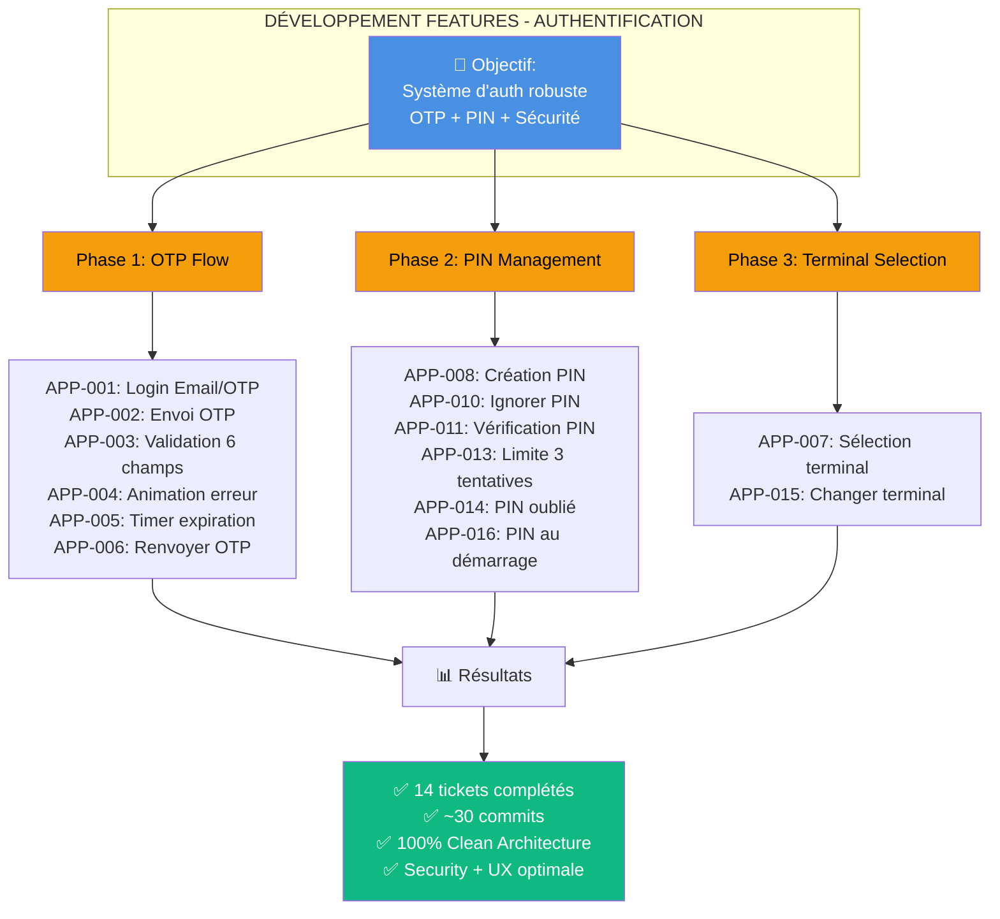
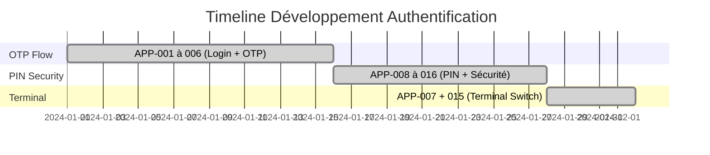
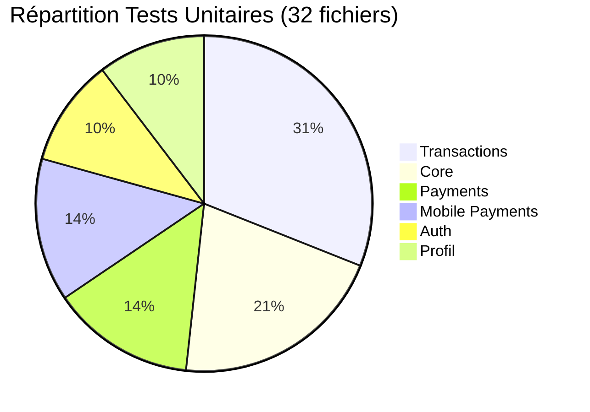
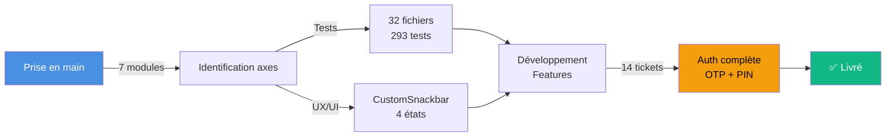
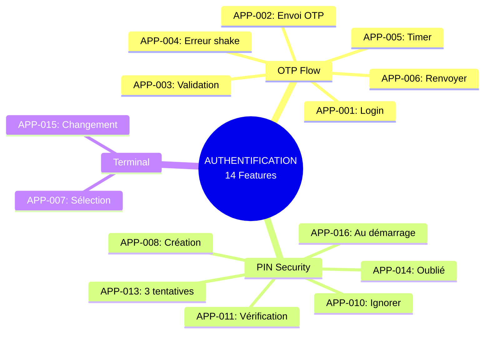
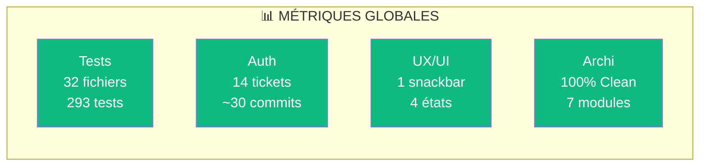
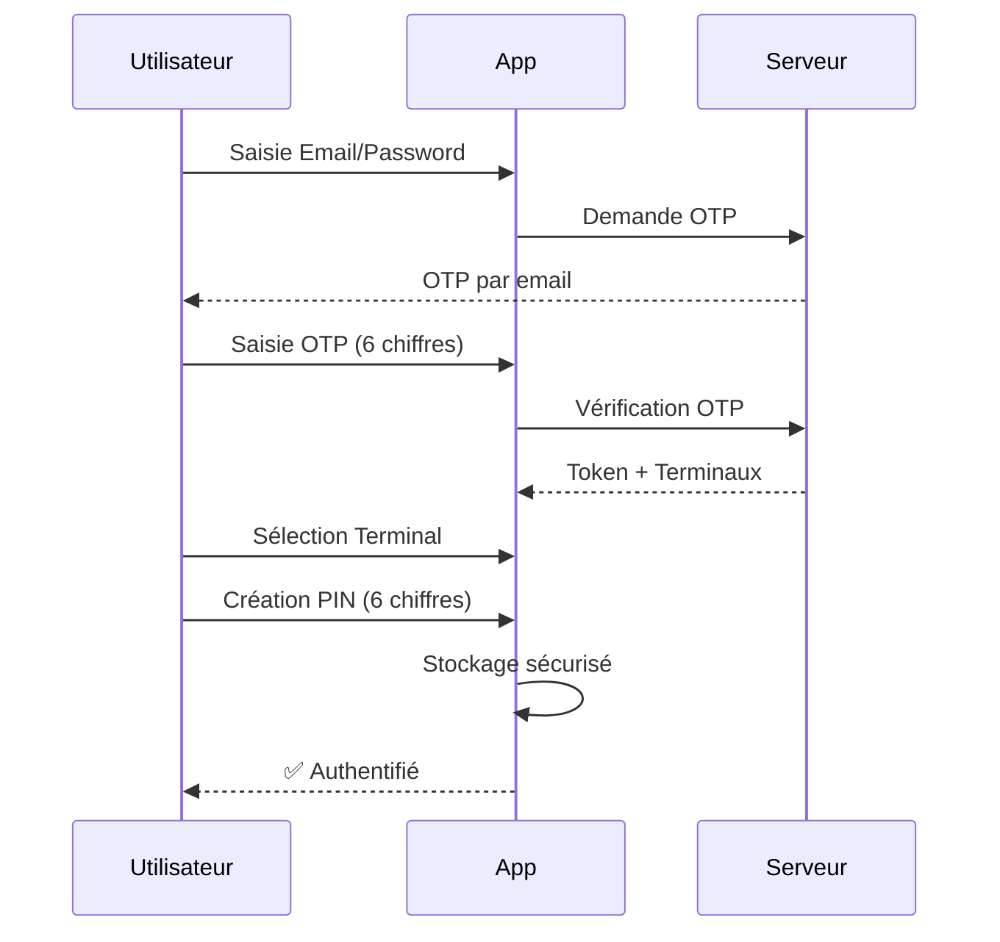

# VISUELS MERMAID - PRÉSENTATION DÉVELOPPEMENT FEATURES

---

## **VISUEL 1 : Architecture Développement Auth (Graph)**



**Utilisation :** Vue d'ensemble structurée des 3 phases de développement

---

## **VISUEL 2 : Timeline Gantt**



**Utilisation :** Chronologie du développement des features

---

## **VISUEL 3 : Répartition Tests (Pie Chart)**



**Utilisation :** Distribution de l'effort de tests par module

---

## **VISUEL 4 : Flow Projet Global**



**Utilisation :** Flux complet du projet (toutes étapes)

---

## **VISUEL 5 : Features Auth Détaillées (Mindmap)**



**Utilisation :** Vue d'ensemble des 14 features par catégorie

---

## **VISUEL 6 : Metrics Dashboard (Simple)**



**Utilisation :** Slide récapitulatif avec métriques clés

---

## **VISUEL 7 : User Journey Auth (Sequence)**



**Utilisation :** Parcours utilisateur complet

---

## **RECOMMANDATIONS PAR SLIDE**

| Slide | Visuel recommandé | Pourquoi |
|-------|-------------------|----------|
| **Étape 3 - Intro Auth** | Visuel 1 (Graph) | Vue d'ensemble structurée |
| **Étape 3 - Timeline** | Visuel 2 (Gantt) | Chronologie claire |
| **Étape 2.1 - Tests** | Visuel 3 (Pie) | Répartition visuelle |
| **Récapitulatif Global** | Visuel 4 (Flow) ou 6 (Metrics) | Synthèse finale |
| **Détail Features** | Visuel 5 (Mindmap) | Organisation logique |
| **User Flow** | Visuel 7 (Sequence) | Explication métier |

---

## **COMMENT UTILISER CES VISUELS**

### **Dans Gamma.app :**
1. Copiez le code Mermaid (avec les triple backticks)
2. Dans Gamma, cliquez sur "Insert" → "Diagram"
3. Collez le code Mermaid
4. Gamma génère automatiquement le visuel

### **Dans VSCode :**
1. Installez l'extension "Markdown Preview Mermaid Support"
2. Ouvrez ce fichier
3. Cliquez sur "Preview" pour voir les diagrammes

### **En ligne :**
- https://mermaid.live (éditeur en temps réel)
- Exportez en PNG/SVG pour PowerPoint

---

## **PERSONNALISATION**

Pour changer les couleurs, modifiez les lignes `style` :

```
style A fill:#4A90E2,color:#fff   → Bleu
style B fill:#10B981,color:#fff   → Vert
style C fill:#F59E0B,color:#000   → Orange
style D fill:#EF4444,color:#fff   → Rouge
```

---

**Fichier créé :** `presentation_visuels_mermaid.md`
**Date :** 2025-11-10
**Projet :** Todou POS App
